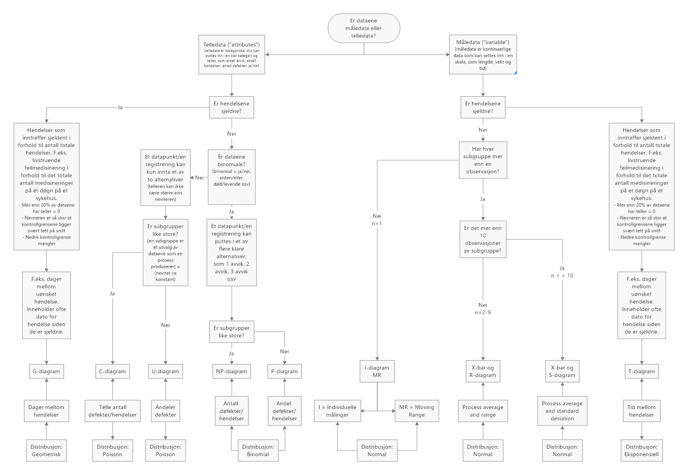

# Datatyper og datafordelinger

Ift statistisk prosesskontroll er det formålstjenlig å snakke om tre hovedtyper data: måledata, telledata og sjeldne hendelser. Måledata er kontinuerlige data – det vil si de kan måles på en skala som høyde, vekt og tid. Her kan en observasjon/et datapunkt innta en hvilken som helst verdi innenfor et gitt spenn. Høyden på en person kan være 178,34227809 cm eller 178,34227808 cm. 

Telledata et kategoriske (også ofte omtalt som diskrete) data – det vil si et datapunkt (en observasjon) kan puttes inn i en klar kategori, som f.eks. antall avvik, antall hendelser, ja/nei, terningkast. Diskrete data har et begrenset antall mulige verdier som er gjensidig utelukkende. Et terningkast med en vanlig terning kan ikke både være 3 og 4 samtidig, en lysbryter kan ikke være av og på samtidig. Et terningkast kan heller ikke være 1,43. Med tanke på datafordeling er både binomial-, Poissonfordeling og geomterisk fordeling diskrete fordelinger, mens normalfordeling og eksponensiell fordeling vil være kontinuerlig (se f.eks. @ugarteProbabilityStatistics2016). 

Når det gjelder sjeldne hendelser kan de være både telledata og måledata. For eksempel vil antall dager mellom en hendelse være en diskret data, mens tid kan måles og vil være kontinuerlige data. Det er spesielle utfordringer med det vi kaller sjeldne hendelser finnes det også egne måter å håndtere dette på i statistisk prosesskontroll, noe vi vil komme tilbake til. For sjeldne henselser vil både geometrisk og eksponensiell fordeling være relevant. Det finnes en god del flere fordelinger enn disse som nå er nevnt, men som @Benneyan1998 viser er normal-, binomial- og Poissonfordeling de tre vesentligste. For en god oversikt over flere fordelinger, se f.eks. @Mun2008.

Hvorfor fokus på fordelinger?

Fordelingene – normalfordeling, binomialfordeling, Poissionfordeling, geometrisk fordeling og eksponensiell fordeling – beskriver ulike fordelinger ut fra hvordan dataene ser ut. Vi bruker forventningene/sannsynlighetene for ulike verdier i statistisk prosesskontroll til å vurdere om en verdi av en observasjon eller måling er innenfor eller utenfor det vi vil kalle normal variasjon (jfr kapittelet om variasjon). Siden dataene kan være av ulik type – diskret eller kontinuerlig, binomial/ikke binomial osv – bruker vi ulike utregningsmetoder og diagrammer i statistisk prosesskontroll for å få et riktig resultat.  Det finnes et antall ulike diagrammer å velge mellom i statistisk prosesskontroll. For å gjøre valget sikrere og lettere kan man bruke følgende flytskjema for å orientere seg.

Siden lesbarheten er litt dårlig for flytskjemaet under kan følgende også brukes:
```{r echo=FALSE, eval=TRUE}

xfun::embed_file('Flytdiagram_valg.html')
```



Senere kommer vi tilbake til de ulike diagrammene gjennom praktiske eksempler. Før vi kommer dit vil vi gå gjennom de sentrale datafordelingstypene.

## Normalfordeling

Når vi snakker om distribusjonen av et datasett tenker vi på hvordan dataene vi har samlet inn fordeler seg i forhold til hverandre etter gitte egenskaper. Vi kan for eksempel ha målt høyden på 100 mennesker. Disse dataene utgjør da en observert fordeling som vi kan sette inn i et diagram for å visualisere hvordan datasettet ser ut. 

```{r echo = FALSE, message = FALSE, warning=FALSE, fig.cap = "Høydefordeling for 100 tilfeldige menn, genererte data"}

library(tidyverse)

set.seed(30)
x = rnorm(100, 179, 16)
hist(x, xlab = "Høyde", ylab = "Antall", main = "Histogram for genererte høydedata")

```

Hvis vi samler inn høydedata for 100 andre tilfeldig menn kan fordelingen se slik ut:

```{r echo = FALSE, message = FALSE, warning=FALSE, fig.cap = "Høydefordeling for 100 andre tilfeldige menn, genererte data"}

data1 <- sample(165:175, 50, replace=TRUE)
data2 <- sample(170:180, 30, replace=TRUE)
data3 <- sample(180:185, 15, replace = TRUE)
data4 <- sample(185:190, 5, replace = TRUE)

data <- c(data1, data2, data3, data4)

hist(data, xlab = "Høyde", ylab = "Antall", main = "Histogram for genererte høydedata")

```

Hver gang vi måler høyden på 100 tilfeldig utvalgte menn vil fordelingen se ulik ut siden de er observerte fordelinger i et utvalg av populasjonen (alle) «norske menn». Hvis vi imidlertid økte antallet i utvalget vi målte til 1000 eller 10000 vil vi med større sikkerhet kunne si at vi faktisk viser populasjonens fordeling (mulighetene for at vi tilfeldigvis måler 10000 veldig lave eller veldig høye menn er svært liten). Vi kan derfor, gitt visse forutsetninger om utvalget, si noe om hele populasjonen ut fra utvalget. 

Hittil har vi snakket om observerte fordelinger. Ut fra dette kan vi si at vi kan ha visse forventninger til hvordan fordelingen av ulike populasjoner vil se ut, og vi kan snakke om teoretiske fordelinger – eller sannsynlighetsfordelinger med andre ord. Hvor sannsynlig er det at en tilfeldig x-verdi dukker opp i dataene? For høyde kan vi ha visse forventninger til hvilke sannsynligheter det er for at en tilfeldig person har en gitt høyde, eller hvor mange prosent av den mannlige befolkningen som har en høyde innenfor et gitt intervall. Det vil si at fordelingen har en viss form med visse karakteristika. Vi forventer at flest observasjoner befinner seg i nærheten av gjennomsnittet, og at vi vil se færre og færre observasjoner jo lenger unna gjennomsnittet vi beveger oss. Vi forventer å finne flere norske menn over 20 år på rundt 180 cm enn 160 cm eller 210 cm. For fordelingen av høydedata vil vi si at dette er data som er normalfordelte.

En normalfordeling er en sannsynlighetsfunksjon der flesteparten av verdiene fra funksjonen samler seg om en sentral tendens, og der tettheten (hyppigheten) av verdier avtar jevnt jo lenger unna den sentrale tendensen man kommer. Grafisk framstilt får fordelingskurven en klokkeform, og normalfordeling omtales også som "bell shaped".  Overraskende mange fenomener viser seg å være nærme en normalfordeling, og den er derfor en helt sentral teoretisk sannsynlighetsfordeling i mange sammenhenger (også i statistisk prosesskontroll som vi kommer tilbake til senere). Vi bruker dermed normalfordelingen som en modell for observerte data. I en såkalt standard normalfordeling har vi en symmetrisk fordeling der den sentrale tendensen (forventingen) verdi = 0 og et standardavvik = 1. 

Vi skal her ikke bry oss om det matematisk uttrykket for sannsynlighetstetthetsfunksjonen. Hvis vi derimot genererer et tenkt datasett etter standard normalfordelingsfunksjon vil det kunne se slik ut:

```{r echo = FALSE, message = FALSE, warning=FALSE, fig.cap = "Genererte standard normalfordelte data"}

pacman::p_load(ggplot2, readxl, tidyverse, ggfortify)

set.seed(100)

normalfordeling <- rnorm(100, mean = 0, sd = 1)

hist(normalfordeling, 
     main = "Genererte, normalfordelte data", 
     xlab = "x", 
     ylab = "f(x)",
     border = "black", 
     col = "gray",
     xlim = c(-4,4),
     ylim = c(0,0.5),
     las = 1, 
     probability = TRUE)

```

Her kan vi legge på en forventningskurve – en teoretisk kurve som viser en standard normalfordeling:

```{r echo = FALSE, message = FALSE, warning=FALSE, fig.cap = "Genererte standard normalfordelte data med normalfordelingskurve"}

set.seed(100)

normalfordeling <- rnorm(100, mean = 0, sd = 1)

hist(normalfordeling, 
     main = "Genererte, normalfordelte data", 
     xlab = "x", 
     ylab = "f(x)",
     border = "black", 
     col = "gray",
     xlim = c(-4,4),
     ylim = c(0,0.5),
     las = 1, 
     probability = TRUE)

m <- mean(normalfordeling)
std <- sqrt(var(normalfordeling))

curve(dnorm(x, mean = m, sd = std), 
      col="darkblue", lwd = 3, add = TRUE, yaxt = "n")

```

Vi kan ta bort det genererte datasettet og sitte igjen med bare normalfordelingskurven:

```{r echo = FALSE, message = FALSE, warning=FALSE, fig.cap = "Normalfordelingskurve"}

pacman::p_load(ggplot2, readxl, tidyverse, ggfortify)

ggplot(data.frame(x = c(-4, 4)), aes(x)) +
  geom_function(fun = dnorm, colour = "darkblue", size = 1.5) +
  theme_classic() +
  scale_y_continuous(limits = c(0, 0.5), breaks = seq(0, 0.5, by = 0.1))

```

Det den standardiserte normalfordelingskurven (også kjent som Gausskurven eller også Bellkurven – "Klokkekurven" fordi den har en klokkeform) – kan brukes til er å si noe om spredningen på forventede verdier – eller hvor langt fra gjennomsnittsverdien man kan forvente å finne de enkelte verdiene. 

Før vi ser nærmere på egenskaper ved normalfordelingskurven kan det være nødvendig å gå litt inn på begrepene varians og standardavvik som mål på spredningen i datasett. Disse begrepene, spesielt standardavvik, vil være helt sentrale i videre arbeid med temaet.

### Varians og standardavvik

Variansen i en variabel representerer det gjennomsnittlige avviket fra gjennomsnittsverdien [@Field2012] og er et mål på spredningen i dataene (som navnet antyder: hvor mye dataene variere ut fra den sentrale tendensen). Under vises et eksempel basert på @Field2009.

La oss anta at vi har spurt 5 studenter på høgskolen hvor mange kjæledyr de har. Svarene kan settes opp i en enkel tabell. I gjennomsnitt har de 2,6 kjæledyr. Vi ønsker imidlertid å se hvor mye avviket er for den enkelte fra snittet (siden vi har regnet ut snittet kan vi se på gjennomsnittsverdien som en modell på forholdet mellom studenter og antall kjæledyr). Vi registrerer svarene vi fikk i et skjema:

```{r echo = FALSE, message = FALSE, warning=FALSE, fig.cap = "Basert på Field (2009)"}

pacman::p_load(flextable, magrittr)

set_flextable_defaults(fonts_ignore=TRUE)

sdvar <- data.frame(Studentnr = c("1","2", "3", "4", "5", "Snitt", "Sum"),
                            Antall = c("1", "2", "3", "3", "4", "2.6", ""),
                            Avvik = c("-1.6", "-0.6", "0.4", "0.4", "1.4", "", "0"),
                    Avvik_kvadrert = c("2.56", "0.36", "0.16", "0.16", "1.96", "", "5.20"))

sdvar <- flextable(sdvar)

set_table_properties(sdvar, width = 1, layout = "autofit")
```

Når vi regner ut avviket (sum of deviances) summerer vi avvikene. Siden denne er 0 skulle det innebære at det totalt sett i "modellen" ikke er avvik mellom modellen og våre virkelige observasjoner. Problemet her er at det er både positive og negative avvik som nuller hverandre ut. Man må derfor kvadrere avvikene for å omgå problemet med fortegn. Imidlertid får vi et nytt problem. La oss anta at vi i stedet for 5 studenter har spurt 500. Da får vi et svært høyt kvadrert avvik fra snitt. Altså – vi må ta høyde for for antallet observasjoner. Vi deler derfor sum kvadrert avvik fra snitt på antall observasjoner (5,20/5). MEN: vi må foreta et litt teknisk og komplisert tillegg i utregningen. Vi må dele på antall observasjoner MINUS 1 (som er antallet frihetsgrader – degrees of freedom). Dette vil ikke bli nærmere forklart her, men for de som ønsker å lese mer om frihetsgrader kan prøve noen andre kilder, f.eks. @Walker1940, @Good1973 eller @Pandey2008. Vi ender altså opp med regnestykket 5,20/(5-1) = 1,3. Dette er variansen. *Variansen er altså det gjennomsnittlige avviket mellom gjennomsnittsverdien av de observerte dataene og verdiene til de enkelte observasjonene.*

Som regel snakker vi imidlertid om standardavviket. Dette finner vi ved å ta kvadratroten av variansen (som vi jo har funnet ved å kvadrere avvikene for å unngå fortegnsproblemer). Vi får da i vårt tilfelle et standardavvik på 1,14. Variansen og standardavviket forteller oss altså noe om spredningen i dataene. Liten varians betyr at spredningen er liten (om vi har gjennomført en spørreundersøkelse betyr det at respondentene har svart ganske likt). Stor varians betyr stor spredning (respondentene har svart ganske ulikt).

### Normalfordeling, standardavvik og forventninger

Vi kan nå se nærmere på normalfordelingen. 

```{r echo = FALSE, message = FALSE, warning=FALSE, fig.cap = "Normalfordeling med 1 standardavvik"}

x <- seq(-4, 4, length=200)
y <- dnorm(x)

plot(x, y, type="l", lty=1, lwd = 2, col = "red", xlab="x",
  ylab="f(x)")

x <- seq(-1,1,length=100)
y <- dnorm(x)

polygon(c(-1,x,1),c(0,y,0),col="lightblue")

abline(v=-1, col="green", lwd = 2)
text(1.3, 0.38, "1 SD", col = "black")
text(-1.35, 0.38, "-1 SD", col = "black")
abline(v=1, col="green", lwd = 2)

text(0, 0.2, "68 %", col = "black")

```

Ett standardavvik "over og under" 0 (= det skraverte området i grafen over) innebærer at det er 68 % sannsynlighet for at en tilfeldig valgt x-verdi befinner seg i dette intervallet. Vi kan vise det samme for 2 og 3 standardavvik:

```{r echo = FALSE, message = FALSE, warning=FALSE, fig.cap = "Normalfordeling med 2 standardavvik"}

x <- seq(-4,4,length=200)
y <- dnorm(x)

plot(x, y, type="l", lty=1, lwd = 2, col = "red", xlab="x",
  ylab="f(x)")

x <- seq(-2,2,length=200)
y <- dnorm(x)

polygon(c(-2,x,2),c(0,y,0),col="lightblue")

abline(v=-2, col="green", lwd = 2)
text(2.3, 0.38, "2 SD", col = "black")
text(-2.35, 0.38, "-2 SD", col = "black")
abline(v=2, col="green", lwd = 2)

text(0, 0.2, "95 %", col = "black")

```

To standardavvik "over og under" 0 (= det skraverte området i grafen over) innebærer at det er 95 % sannsynlighet for at en tilfeldig valgt x-verdi befinner seg i dette intervallet. Vi kan finne arealet mellom x=-2 og x=2, som er `r pnorm(2,mean=0,sd=1)-pnorm(-2,mean=0,sd=1)`^[R-kode for utregning av areal mellom to x-verdier i en normalfordeing (=sannsynlighet for at en gitt x-verdi ligger i intervallet mellom de to x-verdiene): pnorm(2,mean=0,sd=1)-pnorm(-2,mean=0,sd=1)].

```{r echo = FALSE, message = FALSE, warning=FALSE, fig.cap = "Normalfordeling med 3 standardavvik"}

x <- seq(-4,4,length=200)
y <- dnorm(x)

plot(x,y,type="l",lwd=2,col="red", xlab="x",
  ylab="f(x)")

x <- seq(-3,3,length=200)
y <- dnorm(x)

polygon(c(-3,x,3),c(0,y,0),col="lightblue")

abline(v=-3, col="green", lwd = 2)
text(3.3, 0.38, "3 SD", col = "black")
text(-3.35, 0.38, "-3 SD", col = "black")
abline(v=3, col="green", lwd = 2)

text(0, 0.2, "99.7 %", col = "black")

```

Tre standardavvik "over og under" 0 (= det skraverte området i grafen over) innebærer at det er 99.7 % sannsynlighet for at en tilfeldig valgt x-verdi befinner seg i dette intervallet. Vi kan finne arealet mellom x=-3 og x=3, som er `r pnorm(3,mean=0,sd=1)-pnorm(-3,mean=0,sd=1)`^[pnorm(3,mean=0,sd=1)-pnorm(-3,mean=0,sd=1)]. Dette utgjør et kjernepunkt i statistisk prosesskontroll som vi vil komme mye tilbake til.

Oppsummert kan vi framstille normalfodeling og standardavvik slik [@hartmannVarianceStandardDeviation2018]:

```{r echo = FALSE, message = FALSE, warning=FALSE, fig.cap = "Normalfordeling med standardavvik"}

y.norm <- rnorm(n= 100000, mean = 0, sd = 1)
h <- hist(y.norm, breaks = 100, plot = F)
cuts <- cut(h$breaks, c(-Inf,-3,-2,-1,1,2,3,Inf), right = F) # right=False; sets intervals to be open on the right closed on the left
plot(h, 
     col = rep(c("white", "4","3","2","3","4", "white"))[cuts], 
     main = 'Normalfordeling', 
     xlab = '', 
     freq = F, 
     ylim = c(0,0.6))

lwd = 3
# horzintal lines
lines(x = c(2,-2), y = c(0.48,0.48), type = "l", col=3, lwd = lwd)
lines(x = c(3,-3), y = c(0.55,0.55), type = "l", col=4, lwd = lwd)
lines(x = c(1,-1), y = c(0.41,0.41), type = "l", col=2, lwd = lwd)
# vertical lines
lines(x = c(1,1), y = c(0,0.41), type = "l", col=2, lwd = lwd)
lines(x = c(-1,-1), y = c(0,0.41), type = "l", col=2, lwd = lwd)
lines(x = c(2,2), y = c(0,0.48), type = "l", col=3, lwd = lwd)
lines(x = c(-2,-2), y = c(0,0.48), type = "l", col=3, lwd = lwd)
lines(x = c(3,3), y = c(0,0.55), type = "l", col=4, lwd = lwd)
lines(x = c(-3,-3), y = c(0,0.55), type = "l", col=4, lwd = lwd)
# text
text(0, 0.44, "68%", cex = 1.5, col=2)
text(0, 0.51, "95%", cex = 1.5, col=3)
text(0, 0.58, "99.7%", cex = 1.5, col=4)
```


Som nevnt er mange fenomener i hverdagen normalfordelte, eller nærme nok normalfordeling til at vi kan bruke normalfordeling som teoretisk modell for observerte data ^[Normalfordelingen er dessuten en god tilnærming til binomialfordeling med høyt antall observasjoner (høy n), og også til poissonfordeling med høy frekvens. Dette forfølger vi imidlertid ikke videre i dette kompendiet.]. Det finnes imidlertid mange tilfeller der vi ikke kan bruke normalfordelingen. Hvis dataene er sterkt asymmetriske vil ikke reglene for normalfordeling som vi har skissert ovenfor gjelde ^[Chebyshevs teorem vil imidlertid gjelde for alle datasett. Teoremet belyses i eget vedlegg for de spesielt interesserte].  Noen av de er viktige for statistisk prosesskontroll, og de vil vi se på i de følgende avsnittene.

## Binomialfordeling

En distribusjon hvor det kun er to mulige utfall av en hendelse kalles en binomial fordeling. Et myntkast er en slik hendelse (gitt at vi ser bort fra den fysiske muligheten at mynten kan lande stående på høykant). Levende eller død kan også være et eksempel på dette. Det ene utfallet utelukker det andre, men de er uavhengige fordi resultatet i ett myntkast ikke påvirker resultatet i neste myntkast. Alle myntkastene må derimot være identiske, det vil si sannsynligheten for det ene eller det andre resultatet er lik hver gang forsøket eller myntkastet gjennomføres. Hvis vi har lik sannsynlighet, kan en tilfeldig generert binomial distribusjon se slik ut:

```{r echo = FALSE, message = FALSE, warning=FALSE, fig.cap = "Binomialfordeling med lik sannsynlighet"}

success <- 0:20

plot(success,dbinom(success,size=20,prob=.5),
     type='h',
     main="Binomial distribusjon (n=20, p=0.5)",
     ylab="Sannsynlighet",
     xlab = "Suksess",
     lwd=10)
```

I diagrammet over vises en sannsynlighetsfordeling for en binomial fordeling der utfallene suksess/fiasko har lik sannsynlighet. Hvis vi gjennomfører en aktivitet med disse karakteristika 20 ganger kan vi bruke sannsynlighetsfordelingen til å skape en forventning om sannsynligheten for antall suksesser/fiaskoer. Hver gang vi gjennomfører aktiviteten blir det enten suksess eller fiasko. Hvis vi har 50% sjanse for suksess eller feil hver gang vi gjennomfører aktiviteten er sannsynligheten for suksess lik som sannsynligheten for fiasko. Vi kan da forvente at det er størst sannsynlighet at vi i 10 av 20 tilfeller får suksess. Det er liten sannsynlighet for at vi enten får suksess i 0 eller 20 av 20 ganger vi gjør aktiviteten.

Det er imidlertid verdt å merke seg at de to utfallene ikke trenger å ha lik sannsynlighet. Da vil den binomiale distribusjonen se annerledes ut:

```{r echo = FALSE, message = FALSE, warning=FALSE, fig.cap = "Binomialfordeling med ulik sannsynlighet"}

success <- 0:20

plot(success,dbinom(success,size=20,prob=.2),
     type='h',
     main="Binomial distribusjon (n=20, p=0.2)",
     ylab="Sannsynlighet",
     xlab = "Suksess",
     lwd=10)

```

Her har vi bare 20% sannsynlighet for suksess, og fordelingen av sannsynligheter vil se annerledes ut. Med 20% sannsynlighet for suksess er det veldig liten sannsynlighet for at vi vil få 10 eller flere suksesser hvis vi gjør forsøket 20 ganger. Det er størst sannsynlighet for å få 4 suksesser.

Et terningkast (med en vanlig terning med 6 sider) – som ikke er tuklet med – har lik sannsynlighet for å lande på hhv 1,2,3,4,5 og 6. Det vil si det er 1/6 sannsynlighet for 1, 1/6 sannsynlighet for 2 osv. Hvis vi kaster denne terningen 10 ganger kan resultatet se slik ut:

```{r echo = FALSE, message = FALSE, warning=FALSE, fig.cap = "10 terningkast"}

set.seed(32)

terning10 <- sample(1:6, 10, replace = TRUE)

stripchart(terning10, method = "stack", offset = .5, at = 0, pch = 19,
           col = "steelblue", main = "10 terningkast", xlab = "Verdi på terning", ylab = "Antall")

```

Vi ser at vi ikke fikk noen 2’ere og 5’ere. Dette kan vi forvente når vi bare har 10 terningkast. Hvis vi imidlertid kaster terningen 100 ganger vil det være svært liten sannsynlighet for å ikke få «treff» på alle 6 verdiene på terningen, og vi burde kunne forvente at vi får en ganske jevn fordeling på alle 6 verdiene. Nedenfor vises resultatet av 100 terningkast.

```{r echo = FALSE, message = FALSE, warning=FALSE, fig.cap = "100 terningkast"}

set.seed(33)

terning10 <- sample(1:6, 100, replace = TRUE)

stripchart(terning10, method = "stack", offset = .5, at = 0, pch = 19, col = "steelblue", main = "100 terningkast", xlab = "Verdi på terning", ylab = "Antall")

```

Vi ser at vi har en relativt jevn fordeling. Noe ulikhet er det selvsagt, noe vi vil forvente fra en tilfeldig prosess. Hvis vi gjennomførte 1000 eller 10000 terningkast vil fordelingen bli nærmere og nærmere den teoretisk forventede fordelingen. Vi kan burde, teoretisk, forvente 100 treff på hver mulighet hvis vi kaster terningen 600 ganger, men vi vil sjelden se akkurat 100 treff på hver slik vi ser hvis vi kjører tre runder med 600 terningkast:

Runde 1:  
```{r echo = FALSE, message = FALSE, warning=FALSE}

set.seed(43)
terning_runde1 <- sample(1:6, 600, replace = TRUE)
table(terning_runde1)
```

Runde 2:  
```{r echo = FALSE, message = FALSE, warning=FALSE}
set.seed(44)
terning_runde2 <- sample(1:6, 600, replace = TRUE)
table(terning_runde2)
```

Runde 3:  
```{r echo = FALSE, message = FALSE, warning=FALSE}
set.seed(45)
terning_runde3 <- sample(1:6, 600, replace = TRUE)
table(terning_runde3)
```

Selv om vi kjører 6 000 000 terningkast og vil forvente 1 000 000 treff på hver av terningens sider vil vi ikke få en perfekt fordeling iht teoretisk forventning, men resultatet vil være svært nærme og er nærme nok til at vi kan bruke sannsynlighetsfordelingen til å lage forventninger om utfall:

6 000 000 terningkast:
```{r echo = FALSE, message = FALSE, warning=FALSE}
set.seed(46)
minterning <- sample(1:6, 6000000, replace = TRUE)
table(minterning)
```

Hvis vi setter resultatet fra 6 000 000 terningkast inn i et histogram ser vi at resultatet er svært nærme hva vi teoretisk vil forvente:

```{r echo = FALSE, message = FALSE, warning=FALSE, fig.cap = "6 000 000 terningkast"}

options(scipen=999)
hist(minterning,
     main="Histogram for 6 000 000 terningkast",
     ylab="Antall",
     xlab = "Verdi på terning")
```

## Poissonfordeling

Poissonfordelinger finnes i situasjoner der hendelser skjer vilkårlig i tid (og rom) hvor vi er interessert i kun antallet hendelser i et gitt tidsintervall. Vi kan f.eks. være interessert i hvor mange supporthenvendelser vi får i løpet av en time, antallet feilmedisineringer per uke, hvor mange besøk avdelingen får per dag o.l. Andre eksempler kan være antall trafikkulykker langs en angitt veistrekning, antall elgpåkjørlser på en togstrekning, eller antall av en gitt art fugler i et definert område i et definert tidsrom. En hendelse må være uavhengig tidsmessig av andre hendelser (det er altså ikke økt sannsynlighet for at en hendelse vil skje fordi en tilsvarende hendelse akkurat har skjedd), sannsynligheten for en hendelse i et kort perspektiv er lik sannsynligheten over et lengre perspektiv, og ettersom et tidsintervall blir kortere og kortere vil sannsynligheten for hendelsen gå mot null. 

Poissonfordeling uttrykker sannsynligheten for at et gitt antall hendelser inntreffer i et gitt tidsintervall (eller et gitt geografisk domene) *og* at vi kjenner gjennomsnittlig hvor ofte hendelsen inntreffer. Denne sannsynligheten uttrykkes som en lambdaverdi ($\lambda$).

Eksempelet under er hentet fra @soagePoissonDistribution2020:


```{r echo = FALSE, message = FALSE, warning=FALSE, fig.cap = "Poissonfordelinger"}

# Grid of X-axis values
x <- 0:50

#-----------
# lambda: 5
#-----------
lambda <- 5
plot(dpois(x, lambda), type = "h", lwd = 2,
     main = "Poisson sannsynlighetsfordeling",
     ylab = "P(X = x)", xlab = "Antall hendelser")

#-----------
# lambda: 10
#-----------
lambda <- 10
lines(dpois(x, lambda), type = "h", lwd = 2, col = rgb(1,0,0, 0.7))

#-----------
# lambda: 20
#-----------

lambda <- 20
lines(dpois(x, lambda), type = "h", lwd = 2, col = rgb(0, 1, 0, 0.7))

# Legend
legend("topright", legend = c("5", "10", "20"),
       title = expression(lambda), title.adj = 0.75,
       lty = 1, col = 1:3, lwd = 2, box.lty = 0)

```

Ut fra hvilken $\lambda$-verdi vi setter kan vi si noe om sannsynligheten for at et antall hendelser inntreffer. 

@ugarteProbabilityStatistics2016 eksemplifiserer Poissonfordeling ved å vise til at det i gjennomsnitt skåres 2,5 mål i en VM-kamp i fotball. Denne situasjonen tilfredsstiller forutsetningene for å bruke Possionfordeling.Vi kan grafisk framstille sannsynlighetsfordeingen slik:

```{r echo = FALSE, message = FALSE, warning=FALSE, fig.cap = "Poissonfordeling mål i VM-kamp fotball"}

maal <- 0:10

plot(maal, dpois(maal, lambda=2.5),
     type='h',
     main='Poissonfordeling (lambda = 2.5)',
     ylab='Sannsynlighet',
     xlab ='# Mål',
     lwd=3)

```

I R kan vi også enkelt regne ut den nøyaktige sannsynligheten for x antall mål gitt forutsetningen om at det i snitt skåres 2.5 mål pr kamp til å være `r dpois(x = 2.5, lambda = 2.5) `. Vi kan bruke sannsynlighetsfordelingen til å regne ut sannsynligheten for et gitt antall mål, f.eks.:

* Sannsynligheten for 0 mål = `r dpois(x = 0, lambda = 2.5) `
* Sannsynligheten for 1 mål = `r dpois(x = 1, lambda = 2.5) `
* Sannsynligheten for 2 mål = `r dpois(x = 2, lambda = 2.5) `
* Sannsynligheten for 3 mål = `r dpois(x = 3, lambda = 2.5) `
* Sannsynligheten for 4 mål = `r dpois(x = 4, lambda = 2.5) `

eller f.eks. sannsynligheten for at det skåres mellom 1 og 3 mål (= `r dpois(x = 1, lambda = 2.5) + dpois(x=2, lambda = 2.5) + dpois(x=3, lambda = 2.5)`).

## Geometrisk fordeling

En geometrisk fordeling er en diskret fordeling der man teller antall hendelser/forsøk inntil et gitt resultat forekommer. Resultatet er suksess eller feil, altså hvor mange ganger man har en hendelse før man får en suksess eller feil (avhengig av hva man måler). Et eksempel er hvor mange ganger man må kaste to terninger for å få 11 i sum. Man kaster da to terninger til første gang man får 11 (= suksess). En geometrisk distribusjon kan se slik ut (p = 0,4):

```{r echo = FALSE, message = FALSE, warning=FALSE, fig.cap = "Geometrisk fordeling"}

x_dgeom <- seq(1, 20, by = 1)

y_dgeom <- dgeom(x_dgeom, prob = 0.4) 

plot(y_dgeom,
type="l",     
main="Geometrisk fordeling for p = 0.4",
ylab="f(x)",
xlab = "x")
```

I statistisk prosesskontroll er denne typen fordeling til stede når man f.eks. teller antall dager mellom sjeldne hendelser. Man teller antall dager før man f.eks. får et alvorlig avvik på en medisinering, en operasjon e.l. I geometrisk fordeling er sannsynligheten for et gitt utfall uavhengig av om det har skjedd før. Man kan bruke geometrisk fordeling f.eks. til å estimere hvor mange dager man normalt vil forvente det går mellom en sjelden hendelse. Hvis man gjennom erfaringstall vet at sannsynligheten for en sjelden hendelse er p = 0.035 vil man forvente at det går 1/0.035 $\approx$ 29 dager mellom hver hendelse. Geometrisk distribusjon kan hjelpe oss i en statistisk prosesskontroll for å finne normal/unormal variasjon ved sjeldne hendelser.

Det kan være verdt å merke seg at binomial og geometrisk fordeling skiller seg fra hverandre ved at geometrisk fordeling har et ukjent antall hendelser (man fortsetter til man får første suksess/feil), mens binomial fordeling har et gitt antall hendelser. Som vi skal se i senere eksempler derfor geometrisk fordeling viktig når vi håndterer sjeldne hendelser, fordi vi ikke kjenner hvor mange dager det f.eks. går før vi får første suksess/feil. 

## Eksponensiell fordeling

En tilfeldig kontinuerlig variabel kan sies å være analog til den geometriske distribusjonen, men for kontinuerlige data. Den eksponensielle distribusjonen brukes ofte for å modellere tid mellom to hendelser. I statistisk prosesskontroll vil vi typisk bruke denne distribusjonen hvis vi måler tid mellom to sjeldne hendelser. Hvis vi f.eks. måler tiden mellom uventet dødsfall som følge av en type rutineoperasjon på et sykehus vil den ha en eksponensiell distribusjon hvis sannsynligheten for at hendelsen inntreffer innenfor t gitt tidsintervall er omtrentlig proporsjonal med lengde på tidsintervallet [@Taboga2017]. Eksponensielle fordelinger har samme grunnform, men kan ha ulik bratthet avhengig av den såkalte lamdaverdien (= en parameter for raten av hendelser). Lambdaverdi er en parameter for hvor ofte hendelsene forventes å skje. 

```{r echo = FALSE, message = FALSE, warning=FALSE, fig.cap = "Eksponensiell fordeling"}

pacman::p_load(ggpubr)

eksford <- seq(0, 20, length.out=1000)

dat1 <- data.frame(x=eksford, fx=dexp(eksford, rate=0.2)) %>%
  add_column(ID = 1:1000) %>%
  relocate(3)
             
dat2 <- data.frame(x=eksford, fx=dexp(eksford, rate=1)) %>%
  add_column(ID = 1:1000) %>%
  relocate(3)
             
dat3 <- data.frame(x=eksford, fx=dexp(eksford, rate=1.5)) %>%
  add_column(ID = 1:1000) %>%
  relocate(3)
             
dat4 <- data.frame(x=eksford, fx=dexp(eksford, rate=2)) %>%
  add_column(ID = 1:1000) %>%
  relocate(3)
             

dat1plot <- ggplot(dat1, aes(x=x, y=fx)) + geom_line() + ggtitle(expression( ~ lambda ~ " = 0.2"))
dat2plot <- ggplot(dat2, aes(x=x, y=fx)) + geom_line() + ggtitle(expression( ~ lambda ~ " = 1.0"))
dat3plot <- ggplot(dat3, aes(x=x, y=fx)) + geom_line() + ggtitle(expression( ~ lambda ~ " = 1.5"))
dat4plot <- ggplot(dat4, aes(x=x, y=fx)) + geom_line() + ggtitle(expression( ~ lambda ~ " = 2.0"))

ggarrange(dat1plot, dat2plot, dat3plot, dat4plot + rremove("x.text"), ncol = 2, nrow = 2,  widths = c(1, 1))

```

