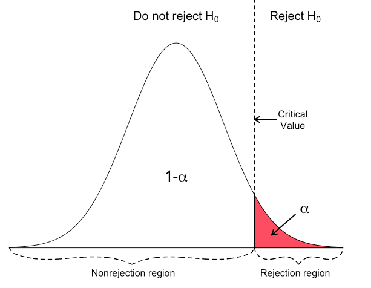

# Er dataene dine normalfordelte?

I forrige kapittel viste vi til at data har ulike fordelinger, og at ulike analyser vi gjør i statistisk prosesskontroll har forutsetninger/bygger på antalkelser om hvordan dataene er fordelt (det gjelder forsåvidt alle statistiske analyser vi gjør). Så i dette kapittelet skal vi se nærmere på hvordan vi kan avgjøre om dataene våre er normalfordelte - i mange tilfeller vil det være hensiktsmessig å først sjekke for normalitet siden veldig mange statistiske analyser forutsetter det ^[Det er tildels stor uenighet om hvor alvorlig avvik fra normalfordelingens teoretiske forventning man kan være for likevel å bruke ulike statistiske analyser. Mange analyser er ganske robuste for avvik. Det beste rådet tror vi er å være bevisst på dette og sjekke med statistikkbøker og artikler hvor robuste de enkelte analysene er for avvik]. Vi skal også være klar over at utregning av såkalte testverdier (som Shapiro-Wilk eller Anderson-Darling) også bygger på visse forutsetninger. Vi har imidlertid en metode som vi kan kalle forutsetningsfri som vi anbefaler å begynne med: Q-Q plott.

## Q-Q plott

Både histogrammet og Q-Q plottet er visuelle måter å undersøke om en distribusjon er normalfordelt eller ikke. Selv om de ikke alltid gir et entydig svar er de egnet til å gi oss et inntrykk av om en datadistribusjon er normalfordelt eller ikke. Setter man en normalfordelingskurve på et histogram gir det en indikasjon. Som hjelpemiddel er imidlertid Q-Q plott langt bedre.

Q-Q plottet ("quantile-quantile plot") kan tolkes ved å se om dataverdiene ligger langs en rett linje med ca 45 graders vinkel. Q-Q plottet (se video for forklaring på utregning) innebærer å se to distribusjoner mot hverandre – empirisk fordeling (dataene) og teoretisk forventning ut fra en fordelingsmodell (som normalfordeling om vi snakker om "normal Q-Q plott - dvs vi ser om vår empiriske datafordeling og normalfordelingen er lik). Om de samsvarer perfekt ligger de på en helt rett linje (x = y). I eksempelet under vil da alle punktene ligge perfekt oppå den rette linjen. Siden vi vet den teoretiske distribusjonen til normalfordelingen, kan vi bruke denne teoretiske fordelingen til å plotte den mot datasettet vi sitter med.  

Vi har laget en video som viser hvordan du kan lage et Q-Q plott "fra scratch" i [Excel](https://vimeo.com/625625741). Statistikkprogrammer (som R og evt statistikk/SPC plug-ins i Excel) lager naturligvis dette (og regner ut testverdier) svært raskt og enkelt for oss.

La oss først se på et Q-Q plott som viser en normalfordeling (du kan laste ned Excelfila hvis du ønsker dataene):

```{r echo=FALSE, eval=TRUE}

pacman::p_load(tidyverse, ggplot2, writexl, ggpubr)

# Lage normalfordelt datasett

set.seed(89)

qqnorm <- rnorm(10000, mean=90, sd=5)

qqnorm <- as_tibble(qqnorm)

# Eksporter som Excel

write_xlsx(qqnorm,"QQ_norm.xlsx")
```

```{r echo=FALSE, eval=TRUE}

xfun::embed_file('QQ_norm.xlsx')
```

```{r echo = FALSE, message = FALSE, warning=FALSE, fig.cap = "Q-Q plott normalfordeling"}

pacman::p_load(ggplot2, tidyverse, readxl, ggpubr)

ggqqplot(qqnorm$value) + ggtitle("Normal Q-Q plott") + labs(x = "Teoretisk forventning", y = "Data")

```

Vi ser at dette Q-Q plottet viser oss at vi kan være ganske sikre på at dette datasettet er normalfordelt (noe som gir meninig siden vi har brukt R til å lage et normalfordelt datasett).

Tolkning av Q-Q plott er imidlertid ikke alltid så enkelt som i eksempelet ovenfor - det er en viss grad av subjektivitet involvert. Underhar vi gjengitt noen typiske mønstre vi kan se og hva de skyldes. Som et supplement til Q-Q plott kan vi bruke ulike testverdier (fra f.eks. Shapiro-Wilk og Anderson-Darling). Disse kommer vi tilbake til senere i kapittelet.

I det første eksempelet på avvik fra den helt klare normalfordelingen lager vi et datasett som har en skjevhet mot høyre ("right skewness") - også kalt positiv skjevhet (uten at det legges noe "positivt" i positivt). Datasettet kan lastes ned i Excelformat her:

```{r echo=FALSE, eval=TRUE}

xfun::embed_file('QQ_norm_rs.xlsx')
```

```{r  echo = FALSE, message = FALSE, warning=FALSE, fig.cap = "Q-Q plott - fordeling skjevhet høyre"}

pacman::p_load(gridExtra, writexl, ggplot2, tidyverse, ggpubr)

# Lage datasett med right skew

set.seed(90)

N <- 5000
qqrightskew <- rnbinom(N, 10, .1)
 
qqrightskew <- as_tibble(qqrightskew)

# Eksportere datasettet

write_xlsx(qqrightskew,"QQ_norm_rs.xlsx")

# Plotte histogram og Q-Q plott"

qqrighthist <- ggplot(qqrightskew, aes(x=value)) + geom_histogram(color="black", fill="lightblue")

qqrightskew_plott <- ggqqplot(qqrightskew$value) + ggtitle("Normal Q-Q plott - skjevhet høyre") + labs(x = "Teoretisk forventning", y = "Data")

grid.arrange(qqrighthist, qqrightskew_plott, ncol=2)

```

I et datasett med høyreskjevhet vil ofte Q-Q plottet vise en bananform med "bunnen"/midten av bananen ned mot høyre hjørne og endene pekende oppover/utover fra den rette linjen.

I det neste datasettet har vi generert en kraftig skjevhet til venstre. Q-Q plottet får da en omvendt bananform i forhold til høyre skjevhet, altså en topp på midten og to ender som svinger nedover ift den rette linja. Datasettet finner du her:
```{r echo=FALSE, eval=TRUE}

xfun::embed_file('QQ_norm_ls.xlsx')
```


```{r echo = FALSE, message = FALSE, warning=FALSE, fig.cap = "Q-Q plott - fordeling skjevhet venstre"}

pacman::p_load(gridExtra, writexl, ggplot2, tidyverse, ggpubr)

# Lage datasett med left skew

set.seed(91)

N=5000
qqleftskew <- rbeta(N,5,1,ncp=0)

qqleftskew <- as_tibble(qqleftskew)

# Eksportere datasettet

write_xlsx(qqleftskew,"QQ_norm_ls.xlsx")

# Plotte histogram og Q-Q plott

qqlefthist <- ggplot(qqleftskew, aes(x=value)) + geom_histogram(color="black", fill="lightblue")

qqleftskew_plott <- ggqqplot(qqleftskew$value) + ggtitle("Normal Q-Q plott - skjevhet venstre") + labs(x = "Teoretisk forventning", y = "Data")

grid.arrange(qqlefthist, qqleftskew_plott, ncol=2)

```

De neste to tilfellene av avvik vi skal ta for oss er såkalte "light-tailed" (lette haler med liten sannsynlighet for ekstreme verdier og utvalg tendeerer til å ikke fravike gjennomsnittet med mye) og "heavy-tailed" (fete/tunge haler med større sannsynlighet for at ekstreme verdier vil forekomme) fordelinger. Datasett for fete haler er her:
```{r echo=FALSE, eval=TRUE}

xfun::embed_file('QQ_ht.xlsx')
```


```{r echo = FALSE, message = FALSE, warning=FALSE, fig.cap = "Q-Q plott - 'heavy-tail'"}

pacman::p_load(gridExtra, writexl, ggplot2, tidyverse, ggpubr)

set.seed(14)

N=100

qqcauchy <- as_tibble(rcauchy(N, scale = 5)) 

# Eksportere datasettet

write_xlsx(qqcauchy,"QQ_ht.xlsx")

qqcauchyhist <- ggplot(qqcauchy, aes(x=value)) + geom_histogram(color="black", fill="lightblue")

qqcauchy_plott <- ggqqplot(qqcauchy$value) + ggtitle("Normal Q-Q plott - tung hale") + labs(x = "Teoretisk forventning", y = "Data")

grid.arrange(qqcauchyhist, qqcauchy_plott, ncol=2)

```
Fordelinger med tunge haler vil ofte følge en slags S-form, men den er ofte mer "liggende" enn S-formen til fordeling med lette haler. Den starter med å vokse raskere enn normalfordelingen og ender med å vokse saktere. 

Datasettet for lette haler finner du her:
```{r echo=FALSE, eval=TRUE}

xfun::embed_file('QQ_lt.xlsx')
```


```{r echo = FALSE, message = FALSE, warning=FALSE, fig.cap = "Q-Q plott - 'light-tail'"}

pacman::p_load(gridExtra, writexl, ggplot2, tidyverse, ggpubr)

set.seed(81)

qqlt <- runif(n = 1000, min = -1, max = 1)

qqlt <- as_tibble(qqlt)

# Eksportere datasettet

write_xlsx(qqlt,"QQ_lt.xlsx")

# Plotte histogram og Q-Q plott

qqlthist <- ggplot(qqlt, aes(x=value)) + geom_histogram(color="black", fill="lightblue")

qqlt_plott <- ggqqplot(qqlt$value) + ggtitle("Normal Q-Q plott - lett hale") + labs(x = "Teoretisk forventning", y = "Data")

grid.arrange(qqlthist, qqlt_plott, ncol=2)

```
Q-Q plottet for en fordeling med lette haler har ofte en S-form. Dataene vokser saktere enn normalfordelingen i starten før den følger vekstraten til normalfordelingen. Mot slutten vokser den raskere enn normalfordelingen. Derfor bøyer den av fra normalfordelingen.

Til slutt kan vi se på en typisk bimodial fordeling, med datasett her:
```{r echo=FALSE, eval=TRUE}

xfun::embed_file('QQ_bimod.xlsx')
```

```{r echo = FALSE, message = FALSE, warning=FALSE, fig.cap = "Q-Q plott - bimodial"}

pacman::p_load(gridExtra, writexl, ggplot2, tidyverse, ggpubr)

set.seed(10) 

mode1 <- rnorm(50,2,1)
mode1 <- mode1[mode1 > 0] 
mode2 <- rnorm(50,6,1)
mode2 <- mode2[mode2 > 0] 
qqbimod <- as_tibble(sort(c(mode1,mode2)))

# Eksportere datasettet

write_xlsx(qqbimod,"QQ_bimod.xlsx")

# Plotte histogram og Q-Q plott

qqbimodhist <- ggplot(qqbimod, aes(x=value)) + geom_histogram(color="black", fill="lightblue")

qqbimod_plott <- ggqqplot(qqbimod$value) + ggtitle("Normal Q-Q plott - bimodial") + labs(x = "Teoretisk forventning", y = "Data")

grid.arrange(qqbimodhist, qqbimod_plott, ncol=2)

```
Den bimodiale fordelingen viser ofte et brudd eller et distinkt knekkpunkt rundt krysning av den rette linja, med en del av linja på hver side av den rette linja. 

Vi har nå sett på noen typiske eksempler på mønstre i Q-Q plott. Det kan imidlertid være vanskelig å bedømme fordelinger som ligger nære normalfordelingen, men likevel ikke perfekt oppå (du vil trolig aldri se en perfekt match med mindre du har generert et normalfordelt datasett med mange datapunkter). Vi kan supplere Q-Q plottene med visse statistiske tester - det er tema for de neste delkapitlene (men husk: disse statistiske testene har sine egne forutsetninger og er heller ikke uten utfordringer).

## Anderson-Darling test for normalitet

Anderson-Darlings test er en test for å se om et datasett kommer fra en gitt fordeling, f.eks. normalfordelingen [@Anderson1954; @andersonAsymptoticTheoryCertain1952]. Testen setter opp to hypoteser:

* $H_0$: Dataene følger normalfordelingen
* $H_1$: Dataene følger ikke normalfordelingen

Vi har laget en video [basert på @Zaiontz2020] som viser hvordan du kan gjennomføre en A-D test i Excel som ligger . Vi bruker det samme datasettet som i videoen og du kan laste ned datasettet.
```{r echo=FALSE, eval=TRUE}

xfun::embed_file('Anderson-Darling_raw.xlsx')
```

Som vi kan se av resultatet fra testen med pakken **nortest** i R får vi samme verdier som når vi gjør dette manuelt i Excel (jfr video).
```{r echo=FALSE, eval=TRUE}

pacman::p_load(nortest, readxl, tidyverse)

addata <- as_tibble(read_excel("Anderson-Darling_raw.xlsx"))

ad.test(addata$Values)

```
Siden vi vet at nullhypotesen er at datasettet **har** en normalfordeling vil vi forkaste nullhypotesen dersom vi har en signifikant p-verdi (grensen for hva som er signifikant bestemmer vi forsåvidt selv, men vanlige verdier er 0.01, 0.05 og 0.1). Altså - i dette tilfellet har vi en p-verdi=0.04. Vi forkaster derfor nullhypotesen og aksepterer $H_1$ som sier at dataene er trolig ikke er normalfordelte (med andre ord: p-verdien må være større enn signifikansverdien for at vi skal si at dataene trolig er normalfordelte).

I vårt tilfelle ser dette slik ut [@hartmannCriticalValuePValue2018]:



Det er verdt å merke seg at Anderson-Darling testen egentlig ikke forteller deg at dataene dine er normalfordelte, men at det er usannsynlig at de ikke er det om testen viser det. Dette synes kanskje som samme sak, men er i realiteten en viktig erkjennelse – en tørr gressplen er et bevis for at det ikke har regnet, men en våt gressplen er ikke bevis for at det har regnet. En våt gressplen kan skyldes andre ting enn regn. Altså – en signifikant p-verdi på testen gjør at vi forkaster $H_0$ og antar at fordelingen er ikke-normal. En ikke-signifikant p-verdi på gjør at vi med f.eks. 95% konfidens kan si at vi ikke har funnet avvik fra normalfordelingen. 

Tabellarisk kan vi oppsummere vurderingene slik:
```{r echo=FALSE, eval=TRUE}

pacman::p_load(knitr, tidyverse, kableExtra)

adbet <- data.frame(
    'Betingelse' = c("p-verdi $\\le$ valgt signifikansnivå", "p-verdi > valgt signifikansnivå", "Testverdi ($A^2$ verdi) > kritisk verdi", "Testverdi ($A^2$ verdi) $\\le$ kritisk verdi"),
    'Vurdering'= c("Forkast $H_0$ - datene er trolig ikke normalfordelte", "Behold $H_0$ - dataene er trolig normalfordelte", "Forkast $H_0$ - datene er trolig ikke normalfordelte", "Behold $H_0$ - dataene er trolig normalfordelte")
)

kable(adbet, 
  align = "ll",
  escape = F, 
  caption = NULL) %>%
  kable_styling(latex_options = "hold_position", full_width = F)
```

For at vi skal anta at dataene er normalfordelte må altså p-verdien være større enn valgt signifikansnivå og testverdien være mindre eller lik kritisk verdi. Kritisk verdi leses av i tabell i vedlegg 7. Kritisk verdi referer til det punktet i en teoretisk distribusjon man sammenlikner med en testverdi. Som det framgår av tabellen for kritisk verdi i vedlegget er kritisk verdi låst til valgt signifikansnivå. Kritisk verdi er dermed en terskelverdi for statistisk signifikans – kritisk verdi svarer på spørsmålet «hvor langt fra gjennomsnittsverdien må du bevege deg for å dekke en gitt andel av variansen i datasettet» (f.eks. 90%, 95%, 99%). Generelt vil man forkaste nullhypotesen dersom testverdien overstiger den kritiske verdien. I vårt eksempel ovenfor fikk vi en A-verdi på 0,74573. Kritisk verdi for 0,05 (95%) for normalfordeling (vedlegg 7) er 0,752. Her kan man legge merke til at *normtest* pakken i R regner ut A-verdien som er identisk med den A-verdien vi viser i Excelvideoen. Imidlertid gjøres det ofte en korreksjon for sammenlikning med normalfordeling (korreksjoner for ulike fordelinger, jfr vedlegg 7) slik at man får en A^2 verdi. Den har vi i Excel regnet ut til 0,7904. For vår vurdering blir dette viktig - bruker vi A-verdien får vi et forvirrende resultat, der p-verdien sier vi ikke har et normalfordelt datasett. A-verdien er mindre enn kritisk verdi så den indikerer at dataene er normalfordelte, mens A^2-verdien er større og indikerer at de ikke er normalfordelte. Vi må anta at A^2-verdien er mer korrekt, og til slutt konkludere med at vi tror dataene ikke er normalfordelte. 

Vi kan se på et Q-Q plott for dette datasettet også:
```{r echo = FALSE, message = FALSE, warning=FALSE, fig.cap = "Q-Q plott - A-D data"}

pacman::p_load(gridExtra, writexl, ggplot2, tidyverse, readxl)

addata3 <- as_tibble(read_excel("Anderson-Darling_raw.xlsx"))

ggplot(addata3, aes(sample = Values)) +
  stat_qq() +
  stat_qq_line() +
  ggtitle(" Normal Q-Q plott - A-D data") + labs(x = "Teoretisk forventning", y = "Data")

```
Q-Q plottet støtter vår vurdering om at dette datasettet ikke er normalfordelt. Når det gjelder A-D testen skal vi altså være oppmerksom på om programmet vi bruker regner ut den generiske A-verdien eller den mer korrekt A^2-verdien (dersom vi tester for normalfordeling). 

Hvis vi bruker *normtest* på det vi vet er et normalfordelt datasett (jfr vårt første eksempel på et Q-Q plott i dette kapittelet) får vi:

```{r echo=FALSE, eval=TRUE}

pacman::p_load(nortest, readxl, tidyverse)

addata4 <- as_tibble(read_excel("QQ_norm.xlsx"))

ad.test(addata4$value)

```
Her ser vi, ikke overraskende, at både p-verdi og kritisk verdi tilsier at datasettet er normalfordelt.

Det finnes flere andre statistiske tester som kan kjøres for å teste for normalitet, f.eks. Kologorov-Smirnov, Shapiro-Wilks og Cramer Von-Mises test. Vi går ikke inn på manuell utregning av disse i Excel. Anderson-Darling er en modifisering/videreutvikling av Kolmogorov-Smirnov [@guthrieNISTSEMATECHEHandbook2020] og anses ofte som en bedre test.For sammenlikningens skyld kjører vi disse i R:

```{r echo=FALSE, eval=TRUE}

pacman::p_load(nortest, readxl, tidyverse, tseries)

options(scipen=999)

addata5 <- as_tibble(read_excel("Anderson-Darling_raw.xlsx"))

ks.test(addata5, "pnorm")

shapiro.test(addata5$Values)

cvm.test(addata$Values)

```
Tolkning Kolmogorov-Smirnov: Hvis p-verdien er under valgte signifikansnivå (f.eks. 0.05) skal vi anta at datasettet ikke er normalfordelt. Her vil testen peke på at datasettet *ikke* er normalfordelt.

Tolkning av Shapiro-Wilks og Cramer-von Mieses test er lik som for Kolmogorov-Smirnov. 

Som et siste eksempel på en statistisk test for normalitet kan vi bruke Jarque-Bera test. Denne skiller seg litt ut fra de andre ved at den spesifikt ser på skjevhet og kurtosis i datasettet opp mot hva en normalfordeling vil ha. For å gjøre lykken komplett finnes det versjoner av testen:

```{r echo=FALSE, eval=TRUE, message=FALSE}

pacman::p_load(tseries, normtest)

addata6 <- as_tibble(read_excel("Anderson-Darling_raw.xlsx"))

jarque.bera.test(addata6$Values)

ajb.norm.test(addata6$Values, nrepl=2000)

```

Tolkningen er lik som før - hvis p-verdien er mindre enn valgte signifikansnivå peker det mot at datasettet ikke er normalfordelt. Her, i motsetning til de øvrige testene, er p-verdien større enn signifikansnivået (0,05) så det peker mot at datasettet *er* normalfordelt. 

Dette er altså ikke så enkelt. Det finnes mange statistiske tester, som kan gi motsatte indikasjoner på om et datasett er normalfordelt eller ikke. Vårt råd blir: Start alltid med Q-Q plott. Velg evt en teststatistikk, men vær klar over at alle teststatistikker bygger på forutsetninger eller tester ulike sider av distribusjonen. Det vi også kan huske på er at i henhold til sentralgrenseteoremet ("Central Limit Theorem") - se vedlegg 4 - vil populasjonens fordeling være av mindre interesse dersom utvalgsstørrelsen er stor nok. Hva er stor nok? De fleste kilder peker mot at over 30 er "stort nok". 

En siste ting for å gjøre forvirringen komplett... Vi kan ta det opprinnelige Q-Q plottet for dette datasettet og legge på konfidensintervaller:

```{r echo = FALSE, message = FALSE, warning=FALSE, fig.cap = "Q-Q plott - med konfidensgrenser"}

pacman::p_load(ggpubr, tidyverse)

addata7 <- as_tibble(read_excel("Anderson-Darling_raw.xlsx"))

ggqqplot(addata7$Values)

```

Tolkningen er: Dersom Q-Q plottpunktene i all hovedsak ligger innenfor konfidensintervallene (på figuren over markert med grå farge) er dataene "sånn ca. normalfordelte". Vi går ikke nærmere inn på begrepet konfidensintervaller her ut over å si at konfidensintervaller sier noe om gode estimater er. Datasettet vårt er et utvalg. Dette utvalget sammenlikner vi med datafordelingen til et normalfordelt datasett i et Q-Q plott. Q-Q plottet sier oss da, som vi nå vet, noe om vårt datasett og et normalfordelt datasett er like. Dersom vi hypotetisk sett tar uendelig mange utvalg slik vi har fått vårt datasett så kan vi med 95% sikkerhet ^[Gitt at vi har valgt 5% signifikansnivå] si at Q-Q plottdatapunktene vil falle innenfor grensene. Husk at et Q-Q plott ikke er en test for å se om dataene er normalfordelte, men en sjekk om dataene har synlige avvik fra normalfordelingen. 


