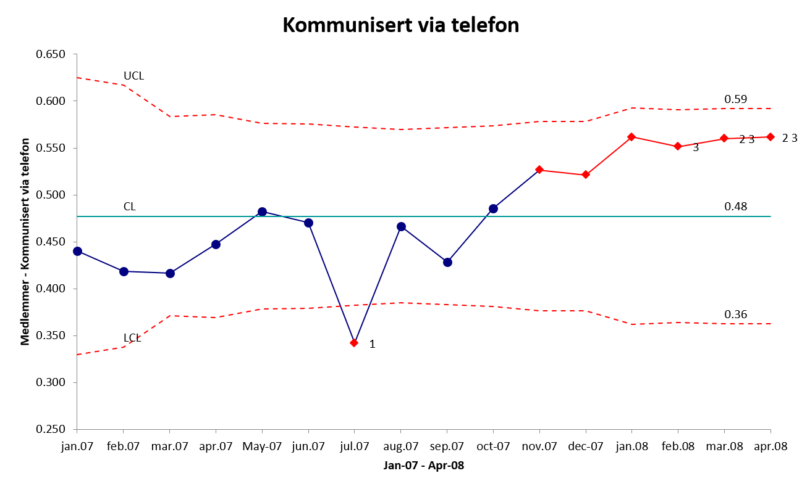
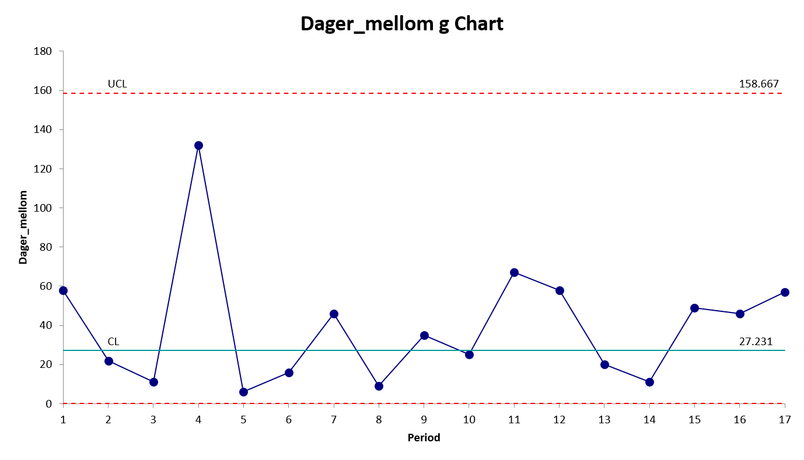

# Kontrolldiagram

Et kontrolldiagram er mer sensitivt for å vise spesielle typer variasjon enn et run diagram. For å oppnå denne økte sensitiviteten er det imidlertid viktig at man velger riktig type kontrolldiagram ut fra hvilken type data man har. Her vil flytdiagrammet på s.xxxx kunne være til hjelp for å velge riktig type, men vi vil også gå gjennom hvert enkelt kontrolldiagram nedenfor. Man skal imidlertid ikke anta at et seriediagram er «mindre verdt» enn et kontrolldiagram. Selv om kontrolldiagram er mer sensitive ovenfor spesielle typer variasjon, er seriediagram mer sensitive ovenfor mindre skifter i dataene (under 2 SD) enn kontrolldiagrammene som typisk reagerer på større skifter i dataene (rundt 2 SD og mer) [@anhojRunChartsRevisited2014]. Et seriediagram kan derfor ofte være et viktig første steg før man tar i bruk mer sofistikerte verktøy som kontrolldiagram [@Perla2011].

En spesiell egenskap ved kontrolldiagram er at den kan hjelpe oss til å se yteevnen til en stabil prosess. Med det mener vi hvilke grenser prosessen trolig vil holde seg innenfor. Dette kalles ofte for prosesskapabilitet. Dette vil vi komme nærmere tilbake til i et senere avsnitt.

Så hva er et kontrolldiagram? Et kontrolldiagram er en statistisk tilnærming til å se på prosesser, variasjon i prosesser og om prosesser produserer resultater innenfor gitte akseptable grenser. Det likner på i stor grad på et seriediagram. Vi plotter inn en rekke hendelser eller observasjoner i et diagram der tiden for observasjonene plottes fortløpende i tid på x-aksen og verdien eller antall hendelser på y-aksen. Det et kontrolldiagram tilfører er at det inkluderer mer avanserte analyser gjennom å regne ut to kontrollgrenser som lar oss vurdere statistisk etter andre regler enn seriediagrammet om en prosess har normal eller unormal variasjon. I tillegg er kontrolldiagrammene basert på at sentraltendensen er gjennomsnittet, ikke median (som i seriediagrammet). 

Shewhart baserte sin tilnærming til kontrolldiagram på matematisk teori (se vedlegg 7 for forklaring på Chebyshevs teorem) og egne empiriske erfaringer når han satt verdiene for øvre og nedre kontrollgrenser til tre sigma (tre standardavvik). Flere tiårs erfaring fra en lang rekke områder viser at tre sigma som grenseverdier holder vann [@Mohammed2008].

Et kontrolldiagram kan se slik ut (R pakken *qicharts2* [@anhojQicharts2QualityImprovement2020]:
```{r echo = FALSE, message = FALSE, warning=FALSE, fig.cap = "Eksempel kontrolldiagram i *qicharts*"}

pacman::p_load(qicharts2, tidyverse, writexl)

set.seed(81)

kontr_eks <- (rnorm(24))

kontr1 <- qic(kontr_eks, chart = 'i', title = "Eksempel på kontrolldiagram", subtitle = "Tilfeldig genererte tall", ylab = "Verdi", xlab = "Hendelse") 

kontr1 + geom_point(size = 2)

kontr_eks <- as_tibble(kontr_eks)

write_xlsx(kontr_eks, "kontr-eks.xlsx")

```
Observasjonene/målingene plottes som punkter sekvensielt i tid. Snittet er -0,2, UCL 2,2 og LCL -2,7.


Tilsvarende data ved bruk av R pakken *qcc* [@Scrucca2017]:
```{r echo = FALSE, message = FALSE, warning=FALSE, fig.cap = "Eksempel kontrolldiagram i *qcc*", results='hide',fig.keep='all'}

pacman::p_load(qcc, tidyverse)

set.seed(81)

kontr_eks <- (rnorm(24))

kontr_eks <- as_tibble(kontr_eks)

kontr2 <- qcc(kontr_eks, type = "xbar.one", nsigmas = 3)

plot(kontr2, title = "Eksempel på kontrolldiagram - Tilfeldig genererte tall", ylab = "Verdi", xlab = "Hendelse")

```

Alle kontrolldiagram vil ha tre horisontale linjer: En gjennomsnittsverdi, en øvre kontrollgrense og en nedre kontrollgrense (øvre og nedre kontrollgrense kan ved enkelte typer kontrolldiagram avvike fra en ren horisontal linje, men ha et horisontalt mønster.

Ulike programmer eller R-pakker gir ulik grafisk framstilling.Analyse-It i Excel gir dette for samme data:


Før vi går inn på kontrolldiagram for hhv telledata og måldata skal vi ta en gjennomgang av typiske mønstre som trekkes fram som kan si oss noe om tolkning av kontrolldiagram (se f.eks. @lavangnanandaClassificationTimeSeries2002 og @Montgomery2020).

## Mønstre i kontrolldiagram

Når vi har laget et kontrolldiagram vil det være noen åpenbare tegn vi vil legge merke til, f.eks. vil vi ganske raskt se om vi har punkter utenfor kontrollgrensene. En annen ting vi raskt kan forsøke å se på er om kontrolldiagrammet viser et gjenkjennbart mønster som kan fortelle oss noe om prosessen og dataene vi har. Vi skal her vise åtte typiske mønstre som blir av flere blir trukket fram (@lavangnanandaClassificationTimeSeries2002 snakker om ni mønster, der det siste omtales som "Mixture" - vi mener imidlertid den i praksis kan være så vanskelig å fange opp eller skille fra et normalt mønster at vi velger å se bort fra denne). Vi viser mønstrene uten mange kommentarer da de fleste er ganske åpenbare.


```{r echo = FALSE}

pacman::p_load(tidyverse, ggpubr)

set.seed(89)

yn <- sample(40:60, 24, replace = TRUE)
xn <- 1:24

normal <- data.frame(xn, yn)

normalplot <- ggplot(normal, aes(xn, yn)) +         
  geom_line() +
  geom_point() + 
  labs(title = "Normalt mønster")


xs <- 1:24
ys <- c(40, 42, 44, 45, 46, 49, 53, 52, 40, 42, 44, 45, 46, 49, 53, 52, 40, 42, 44, 45, 46, 49, 53, 52)

syklisk <- data.frame(xs, ys)

sykliskplot <- ggplot(normal, aes(xs, ys)) +         
  geom_line() +
  geom_point() + 
  labs(title = "Syklisk mønster")


xo <- 1:24
yo <- c(40, 41, 43, 42, 45, 48, 49, 46, 49, 50, 52, 48, 49, 55, 52, 53, 54, 57, 56, 56, 58, 60, 60, 61)

stigende <- data.frame(xo, yo)

stigendeplot <- ggplot(normal, aes(xo, yo)) +         
  geom_line() +
  geom_point() + 
  labs(title = "Stigende mønster")


xsynk <- 1:24
ysynk <- rev(yo)

synkende <- data.frame(xs, ys)

synkendeplot <- ggplot(normal, aes(xsynk, ysynk)) +         
  geom_line() +
  geom_point() + 
  labs(title = "Synkende mønster")


xskifto <- 1:24
yskifto <- c(41, 42, 45, 43, 44, 46, 43, 46, 42, 43, 44, 50, 52, 51, 50, 52, 54, 53, 53, 52, 51, 52, 53, 51)

skiftopp <- data.frame(xskifto, yskifto)

skiftoppplot <- ggplot(normal, aes(xskifto, yskifto)) +         
  geom_line() +
  geom_point() + 
  labs(title = "Skift opp")


xskiftn <- 1:24
yskiftn <- rev(yskifto)

skiftned <- data.frame(xskiftn, yskiftn)

skiftnedplot <- ggplot(normal, aes(xskiftn, yskiftn)) +         
  geom_line() +
  geom_point() + 
  labs(title = "Skift ned")


xstrat <- 1:24
ystrat <- c(48, 49, 52, 51, 51, 50, 49, 51, 48, 48, 49, 50, 51, 52, 52, 50, 49, 48, 48, 50, 49, 50, 51, 49)

stratifisering <- data.frame(xstrat, ystrat)

stratifiseringplot <- ggplot(normal, aes(xstrat, ystrat)) +         
  geom_line() +
  geom_point() + 
  ylim(40, 60) +
  labs(title = "Stratifisering")


xsyst <- 1:24
ysyst <- c(50, 55, 46, 54, 45, 53, 47, 55, 49, 54, 48, 53, 50, 55, 46, 54, 45, 53, 47, 55, 49, 54, 48, 53)

systematisk <- data.frame(xsyst, ysyst)

systematiskplot <- ggplot(normal, aes(xsyst, ysyst)) +         
  geom_line() +
  geom_point() + 
  ylim(40, 60) +
  labs(title = "Systematisk mønster")


ggarrange(normalplot, sykliskplot, stigendeplot, synkendeplot + rremove("x.text"),
ncol = 2, nrow = 2)

ggarrange(skiftoppplot, skiftnedplot, stratifiseringplot, systematiskplot + rremove("x.text"),
ncol = 2, nrow = 2)
```

Det eneste mønsteret vi ønsker å knytte noen korte kommentarer til er "stratifisering" som kanskje ikke er helt intuitiv. Stratifisering regnes som en unormal variasjon ("a special cause") dersom 15 eller flere påfølengde punkter faller innenfor det som kalles sone C (= +/- 1 SD fra snittet). Man sier ofte at punktene "klemmer" senterlinjen, og det kan se ut som prosessen har unormalt liten variasjon. @Montgomery2020 peker på to mulige årsaker: Kontrollgrensene kan være feilkalkulert, eller målingene kan komme fra flere underliggende prosesser. Vi skal ikke gå dypere inn på dette her, men en god gjennomgang av dette er gitt av @roweUnderstandingStratificationStatistical2012 på [denne lenken](http://rowequality.com/sites/default/files/Stratification_in_SPC.pdf).

## Tolkning av kontrolldiagram

Vi skal være oppmerksom på at de kan opererer med ulike "regler" for når de flagger unormal variasjon. Ulike programmer kan imidlertid ha lagt inn noe ulike regler for hva som betraktes som unormal variasjon. Det er derfor lurt å sette seg inn i hvilke regler som benyttes i det programmet du bruker – alle programmene vil, på en eller annen måte, indikere unormal variasjon hvis vi ber programmet om å gjøre det. Og de fleste programmene vil også la oss velge mellom hvilke kontrollregler vi ønsker å bruke. Her må man altså sjekke opp ut fra hvilket program/R-pakke man ønsker å bruke. I det videre vil vi i hovedsak bruke *qcc* og *qicharts2*. Ulike sett regler har vokst fram fra det som regnes som de opprinnelige 4 reglene (1, 2, 5 og 6) [@WesternElectricCompany1956], til @Nelson1984 8 regler som er modifisert av flere, blant annet @Montgomery2020 (som *qicharts2* bruker).Pakken *qcc* bruker reglene 1, 2, 3 og 4 som "Shewhart reglene". 


Eksempel på kontrolldiagram med indikasjon på et eller flere brudd på regler for normal variasjon:

```{r echo = FALSE, message = FALSE, warning=FALSE, fig.cap = "Oversikt regler kontrolldiagram"}

pacman::p_load(qcc, tidyverse)

set.seed(64)

mode1x <- rnorm(15,2,1)
mode1x <- mode1x[mode1x > 0] 
mode2x <- rnorm(15,3,2)
mode2x <- mode2x[mode2x > 0] 
kontr_eks2 <- (sort(c(mode1x,mode2x)))

kontr_eks2 <- as_tibble(kontr_eks2)

qq <- qcc(kontr_eks2, type = "xbar.one", nsigmas = 3)

plot(qq, title = "Eksempel på kontrolldiagram - Tilfeldig genererte tall", ylab = "Verdi", xlab = "Hendelse")

```

```{r echo = FALSE, message = FALSE, warning=FALSE, fig.cap = "Oversikt regler kontrolldiagram"}

pacman::p_load(flextable, magrittr)

set_flextable_defaults(fonts_ignore=TRUE)

kontrdiagr_regler <- data.frame(Test = c("1","2", "3", "4", "5", "6", "7", "8"),
                            Regel = c("1 punkt utenfor kontrollgrensene", "2 av 3 påfølgende punkter er mer enn 2 sigma fra gjennomsnittsverdien og i samme retning", "4 av 5 påfølgende punkter er mer enn 1 sigma fra gjennomsnittsverdien og i samme retning", "8 påfølgende punkter er på samme side av gjennomsnittet", "6 påfølgende punkter er i stigende eller synkende trend (etter hverandre)", "15 påfølgende punkter er innenfor +/- 1 sigma fra gjennomsnittet", "14 påfølgende punkter alternerer opp og ned (annenhver opp og ned i forhold til foregående verdi)", "8 påfølgende punkter på samme side av gjennomsnittet og ingen innenfor +/- 1 sigma"),
                            Indikasjon = c("En større endring", "En mindre, men vedvarende endring", "En mindre, men vedvarende endring", "Ikke-tilfeldig systematisk variasjon", "En middels endring", "En liten endring", "Stratifisering (at vi egentlig har to eller flere prosesser – et histogram vil f.eks. kunne vise en bimodal distribusjon)", "Blandet variasjon"))

kontrdiagr_regler <- flextable(kontrdiagr_regler)

set_table_properties(kontrdiagr_regler, width = 1, layout = "autofit")
```

Vi skal i det følgende vise reglene grafisk. I diagrammene nedenfor viser vi eksempler på kontrolldiagram inndelt i tilsammen seks soner (A, B og C). Sone C er intervallet +/- 1 sigma fra sentraltendensen, sone B er intervallene +/- 1 til 2 sigma fra sentraltendensen og sone A er intervallene +/- 2 til 3 sigma fra sentraltendensen. 

### Punkter utenfor kontrollgrensene:

```{r echo = FALSE, eval = TRUE}

library(ggplot2)
library(ggforce)

x <- c(1, 2, 3, 4, 5, 6, 7)
y <- c(1.5, 0.5, 3.3, -0.5, 1.1, 0.25, -3.2)


z <- data.frame(x,y)

ggplot(data = z, aes(x=x, y=y)) +
  geom_line() + 
  geom_point() +
  xlim(-0.5, 8) +
  geom_hline(yintercept = 0, color = "blue") +
  geom_hline(yintercept = 1, color = "blue", linetype = "dashed") +
  geom_hline(yintercept = -1, color = "blue", linetype = "dashed") +
  geom_hline(yintercept = 2, color = "blue", linetype = "dashed") +
  geom_hline(yintercept = -2, color = "blue", linetype = "dashed") +
  geom_hline(yintercept = 3, color = "blue") +
  geom_hline(yintercept = -3, color = "blue") +
  geom_text(x=-0.5, y=2.5, label="Sone A") +
  geom_text(x=-0.5, y=1.5, label="Sone B") +
  geom_text(x=-0.5, y=0.5, label="Sone C") +
  geom_text(x=-0.5, y=-0.5, label="Sone C") +
  geom_text(x=-0.5, y=-1.5, label="Sone B") +
  geom_text(x=-0.5, y=-2.5, label="Sone A") +
  geom_circle(aes(x0 = 3, y0 = 3.3, r = 0.2),
              inherit.aes = FALSE) +
  geom_circle(aes(x0 = 7, y0 = -3.2, r = 0.2),
              inherit.aes = FALSE) +
  geom_text(x=7.8, y=3.2, label="UCL") +
  geom_text(x=7.8, y=0.2, label="Snitt") +
  geom_text(x=7.8, y=-2.8, label="LCL")
```

### 2 av 3 påfølgende punkter er mer enn 2 sigma fra gjennomsnittsverdien (i sone A) og i samme retning

```{r echo = FALSE, eval = TRUE}

library(ggplot2)
library(ggforce)

x <- c(1, 2, 3, 4, 5, 6, 7)
y <- c(1.5, 2.5, 2.6, 1.8, -0.7, -2.1, -2.4)


z <- data.frame(x,y)

ggplot(data = z, aes(x=x, y=y)) +
  geom_line() + 
  geom_point() +
  xlim(-0.5, 8) +
  geom_hline(yintercept = 0, color = "blue") +
  geom_hline(yintercept = 1, color = "blue", linetype = "dashed") +
  geom_hline(yintercept = -1, color = "blue", linetype = "dashed") +
  geom_hline(yintercept = 2, color = "blue", linetype = "dashed") +
  geom_hline(yintercept = -2, color = "blue", linetype = "dashed") +
  geom_hline(yintercept = 3, color = "blue") +
  geom_hline(yintercept = -3, color = "blue") +
  geom_text(x=-0.5, y=2.5, label="Sone A") +
  geom_text(x=-0.5, y=1.5, label="Sone B") +
  geom_text(x=-0.5, y=0.5, label="Sone C") +
  geom_text(x=-0.5, y=-0.5, label="Sone C") +
  geom_text(x=-0.5, y=-1.5, label="Sone B") +
  geom_text(x=-0.5, y=-2.5, label="Sone A") +
  geom_circle(aes(x0 = 2, y0 = 2.5, r = 0.2),
              inherit.aes = FALSE) +
  geom_circle(aes(x0 = 3, y0 = 2.6, r = 0.2),
              inherit.aes = FALSE) +
  geom_circle(aes(x0 = 6, y0 = -2.1, r = 0.2),
              inherit.aes = FALSE) +
  geom_circle(aes(x0 = 7, y0 = -2.4, r = 0.2),
              inherit.aes = FALSE) +
  geom_text(x=7.8, y=3.2, label="UCL") +
  geom_text(x=7.8, y=0.2, label="Snitt") +
  geom_text(x=7.8, y=-2.8, label="LCL")
```

### 4 av 5 påfølgende punkter er mer enn 1 sigma fra gjennomsnittsverdien (sone A og B) og i samme retning

```{r echo = FALSE, eval = TRUE}

library(ggplot2)
library(ggforce)

x <- c(1, 2, 3, 4, 5, 6, 7)
y <- c(0.9, 1.8, 2.3, 2.2, 1.9, 0.7, 0.5)


z <- data.frame(x,y)

ggplot(data = z, aes(x=x, y=y)) +
  geom_line() + 
  geom_point() +
  xlim(-0.5, 8) +
  geom_hline(yintercept = 0, color = "blue") +
  geom_hline(yintercept = 1, color = "blue", linetype = "dashed") +
  geom_hline(yintercept = -1, color = "blue", linetype = "dashed") +
  geom_hline(yintercept = 2, color = "blue", linetype = "dashed") +
  geom_hline(yintercept = -2, color = "blue", linetype = "dashed") +
  geom_hline(yintercept = 3, color = "blue") +
  geom_hline(yintercept = -3, color = "blue") +
  geom_text(x=-0.5, y=2.5, label="Sone A") +
  geom_text(x=-0.5, y=1.5, label="Sone B") +
  geom_text(x=-0.5, y=0.5, label="Sone C") +
  geom_text(x=-0.5, y=-0.5, label="Sone C") +
  geom_text(x=-0.5, y=-1.5, label="Sone B") +
  geom_text(x=-0.5, y=-2.5, label="Sone A") +
  geom_ellipse(aes(x0 = 3.4, y0 = 2, a = 2, b = 0.6, angle = 0)) +
    coord_fixed() + 
  geom_text(x=7.8, y=3.2, label="UCL") +
  geom_text(x=7.8, y=0.2, label="Snitt") +
  geom_text(x=7.8, y=-2.8, label="LCL")
  
```

### 8 påfølgende punkter er på samme side av gjennomsnittet

```{r echo = FALSE, eval = TRUE}

library(ggplot2)
library(ggforce)

x <- c(1, 2, 3, 4, 5, 6, 7, 8)
y <- c(-0.3, -0.5, -0.4, -1.1, -0.7, -0.5, -0.8, -0.5)


z <- data.frame(x,y)

ggplot(data = z, aes(x=x, y=y)) +
  geom_line() + 
  geom_point() +
  xlim(-0.5, 8) +
  geom_hline(yintercept = 0, color = "blue") +
  geom_hline(yintercept = 1, color = "blue", linetype = "dashed") +
  geom_hline(yintercept = -1, color = "blue", linetype = "dashed") +
  geom_hline(yintercept = 2, color = "blue", linetype = "dashed") +
  geom_hline(yintercept = -2, color = "blue", linetype = "dashed") +
  geom_hline(yintercept = 3, color = "blue") +
  geom_hline(yintercept = -3, color = "blue") +
  geom_text(x=-0.5, y=2.5, label="Sone A") +
  geom_text(x=-0.5, y=1.5, label="Sone B") +
  geom_text(x=-0.5, y=0.5, label="Sone C") +
  geom_text(x=-0.5, y=-0.5, label="Sone C") +
  geom_text(x=-0.5, y=-1.5, label="Sone B") +
  geom_text(x=-0.5, y=-2.5, label="Sone A") +
  geom_text(x=7.8, y=3.2, label="UCL") +
  geom_text(x=7.8, y=0.2, label="Snitt") +
  geom_text(x=7.8, y=-2.8, label="LCL")
  
```

### 6 påfølgende punkter er i stigende eller synkende trend (etter hverandre)

```{r echo = FALSE, eval = TRUE}

library(ggplot2)
library(ggforce)

x <- c(1, 2, 3, 4, 5, 6, 7, 8)
y <- c(-0.3, -0.5, -0.4, 0.1, 0.5, 0.6, 1.1, 0.9)


z <- data.frame(x,y)

ggplot(data = z, aes(x=x, y=y)) +
  geom_line() + 
  geom_point() +
  xlim(-0.5, 9) +
  geom_hline(yintercept = 0, color = "blue") +
  geom_hline(yintercept = 1, color = "blue", linetype = "dashed") +
  geom_hline(yintercept = -1, color = "blue", linetype = "dashed") +
  geom_hline(yintercept = 2, color = "blue", linetype = "dashed") +
  geom_hline(yintercept = -2, color = "blue", linetype = "dashed") +
  geom_hline(yintercept = 3, color = "blue") +
  geom_hline(yintercept = -3, color = "blue") +
  geom_text(x=-0.5, y=2.5, label="Sone A") +
  geom_text(x=-0.5, y=1.5, label="Sone B") +
  geom_text(x=-0.5, y=0.5, label="Sone C") +
  geom_text(x=-0.5, y=-0.5, label="Sone C") +
  geom_text(x=-0.5, y=-1.5, label="Sone B") +
  geom_text(x=-0.5, y=-2.5, label="Sone A") +
  geom_text(x=9, y=3.2, label="UCL") +
  geom_text(x=9, y=0.2, label="Snitt") +
  geom_text(x=9, y=-2.8, label="LCL") +
  geom_ellipse(aes(x0 = 4.5, y0 = 0.3, a = 3.4, b = 0.6, angle = 9.7)) +
    coord_fixed()
  
```

### 15 påfølgende punkter er innenfor +/- 1 sigma fra gjennomsnittet

```{r echo = FALSE, eval = TRUE}

library(ggplot2)
library(ggforce)

x <- c(1, 2, 3, 4, 5, 6, 7, 8, 9, 10, 11, 12, 13, 14, 15)
y <- c(0.3, 0.5, -0.3, -0.5, -0.2, 0.4, 0.8, 0.6, -0.1, -0.3, 0.5, -0.4, 0.4, 0.7, 0.5)


z <- data.frame(x,y)

ggplot(data = z, aes(x=x, y=y)) +
  geom_line() + 
  geom_point() +
  xlim(-0.5, 16) +
  geom_hline(yintercept = 0, color = "blue") +
  geom_hline(yintercept = 1, color = "blue", linetype = "dashed") +
  geom_hline(yintercept = -1, color = "blue", linetype = "dashed") +
  geom_hline(yintercept = 2, color = "blue", linetype = "dashed") +
  geom_hline(yintercept = -2, color = "blue", linetype = "dashed") +
  geom_hline(yintercept = 3, color = "blue") +
  geom_hline(yintercept = -3, color = "blue") +
  geom_text(x=-0.5, y=2.5, label="Sone A") +
  geom_text(x=-0.5, y=1.5, label="Sone B") +
  geom_text(x=-0.5, y=0.5, label="Sone C") +
  geom_text(x=-0.5, y=-0.5, label="Sone C") +
  geom_text(x=-0.5, y=-1.5, label="Sone B") +
  geom_text(x=-0.5, y=-2.5, label="Sone A") +
  geom_text(x=16, y=3.2, label="UCL") +
  geom_text(x=16, y=0.2, label="Snitt") +
  geom_text(x=16, y=-2.8, label="LCL")
```

### 14 påfølgende punkter alternerer opp og ned (annenhver opp og ned i forhold til foregående verdi)

```{r echo = FALSE, eval = TRUE}

library(ggplot2)
library(ggforce)

x <- c(1, 2, 3, 4, 5, 6, 7, 8, 9, 10, 11, 12, 13, 14, 15)
y <- c(0.3, 0.5, -0.3, 0, -0.2, 0.4, -0.8, -0.6, -0.9, -0.3, -0.5, 1.2, 1, 1.7, 0.5)


z <- data.frame(x,y)

ggplot(data = z, aes(x=x, y=y)) +
  geom_line() + 
  geom_point() +
  xlim(-0.5, 16) +
  geom_hline(yintercept = 0, color = "blue") +
  geom_hline(yintercept = 1, color = "blue", linetype = "dashed") +
  geom_hline(yintercept = -1, color = "blue", linetype = "dashed") +
  geom_hline(yintercept = 2, color = "blue", linetype = "dashed") +
  geom_hline(yintercept = -2, color = "blue", linetype = "dashed") +
  geom_hline(yintercept = 3, color = "blue") +
  geom_hline(yintercept = -3, color = "blue") +
  geom_text(x=-0.5, y=2.5, label="Sone A") +
  geom_text(x=-0.5, y=1.5, label="Sone B") +
  geom_text(x=-0.5, y=0.5, label="Sone C") +
  geom_text(x=-0.5, y=-0.5, label="Sone C") +
  geom_text(x=-0.5, y=-1.5, label="Sone B") +
  geom_text(x=-0.5, y=-2.5, label="Sone A") +
  geom_text(x=16, y=3.2, label="UCL") +
  geom_text(x=16, y=0.2, label="Snitt") +
  geom_text(x=16, y=-2.8, label="LCL")
```

### 8 påfølgende punkter på samme side av gjennomsnittet og ingen innenfor +/- 1 sigma

```{r echo = FALSE, eval = TRUE}

library(ggplot2)
library(ggforce)

x <- c(1, 2, 3, 4, 5, 6, 7, 8, 9, 10, 11, 12, 13, 14, 15)
y <- c(0.3, 1.5, 1.3, 1.1, 1.2, 1.4, 1.8, 1.6, 1.9, 1.3, 0.9, 0.5, 0.6, 1.0, 0.5)


z <- data.frame(x,y)

ggplot(data = z, aes(x=x, y=y)) +
  geom_line() + 
  geom_point() +
  xlim(-0.5, 16) +
  geom_hline(yintercept = 0, color = "blue") +
  geom_hline(yintercept = 1, color = "blue", linetype = "dashed") +
  geom_hline(yintercept = -1, color = "blue", linetype = "dashed") +
  geom_hline(yintercept = 2, color = "blue", linetype = "dashed") +
  geom_hline(yintercept = -2, color = "blue", linetype = "dashed") +
  geom_hline(yintercept = 3, color = "blue") +
  geom_hline(yintercept = -3, color = "blue") +
  geom_text(x=-0.5, y=2.5, label="Sone A") +
  geom_text(x=-0.5, y=1.5, label="Sone B") +
  geom_text(x=-0.5, y=0.5, label="Sone C") +
  geom_text(x=-0.5, y=-0.5, label="Sone C") +
  geom_text(x=-0.5, y=-1.5, label="Sone B") +
  geom_text(x=-0.5, y=-2.5, label="Sone A") +
  geom_text(x=16, y=3.2, label="UCL") +
  geom_text(x=16, y=0.2, label="Snitt") +
  geom_text(x=16, y=-2.8, label="LCL") +
  geom_ellipse(aes(x0 = 5.6, y0 = 1.5, a = 4.2, b = 1, angle = 9.5)) +
    coord_fixed()
```

Bruk av regel 1 på en normalfordelte data vil kunne gi «falsk alarm» (vise unormal variasjon når det ikke finnes) i 1 av 370 tilfeller i gjennomsnitt. Hvis man imidlertid legger til testene 2, 5 og 6 stiger raten av feil alarmer til 1 av 91,75 tilfeller. Et godt råd som ofte gis er å velge tester før man lage kontrolldiagrammene basert på kjennskap til prosessen man holder på med. Som @anhojControlChartsQicharts2021 påpeker: "It is a common misunderstanding that control charts are superior to run charts. The confusion may stem from the fact that different sets of rules for identifying non-random variation in run charts are available, and that these sets differ significantly in their diagnostic properties." 

Vi skal i videre i dette kapittelet ta for oss ulike typer kontrolldiagrammene (ref. flytskjema for valg av kontrolldiagram). Vi vil vise et eksempel på hvert av de vanlige kontrolldiagrammene. For hvert eksempel finnes det en Excelfil med dataene som er brukt for de ulike eksemplene og en video som viser framgangsmåten i Excel. Grunnen til dette er at for mange vil Excel være et mye mer kjent grensesnitt enn R. Samtidig, ved å se på videoen og stegene som gjøres, ser man hvordan det enkelte kontrolldiagram er bygd opp. Selvsagt er dette mye mer tidkrevende enn å bare kjøre analysen i R, men det kan gi en fin innsikt i "hva som egentlig skjer". På sikt mener vi det er mye å hente på å bruke R og pakken *qicharts2* eller pakken *qcc*. Alternativt kan man investere i et tillegg til Excel som nevnt i kapittel 1. 


## Telledata (attributter)
Diagrammene i dette delkapittelet handler om data der vi kan telle og putte dataene inn i kategorier. Motsetningen er måledata som er kontinuerlige data som behandles i neste delkapittel. 

### p-diagram

P-diagrammet er trolig det mest brukte diagrammet i helsesektoren [@anhojControlChartsQicharts2021]. Her er dataene binomiale, dvs type ja/nei. Vi kan f.eks. registrere om det er eller ikke er et avvik fra en gitt rutine. P-diagrammet og NP-diagrammet skiller seg kun fra hverandre ved at NP-diagrammet forutsetter en lik størrelse på utvalget hver måling, mens P-diagrammet brukes når utvalgsstørrelsen varierer. Hvis vi f.eks. registrerer antall avvik i en rutine pr uke og antallet gjennomføringer av rutinen varierer fra uke til uke bør vi bruke et P-diagram.

La oss tenke oss at vi har følgende data som viser antall keisersnitt og totalt antall fødsler på et sykehus [eksempeldata modifisert fra @qimacrosSixSigmaSPC2021].

```{r echo = FALSE, message = FALSE, warning=FALSE, fig.cap = "p-diagram data"}

pacman::p_load(flextable, magrittr)

set_flextable_defaults(fonts_ignore=TRUE)

pdiagr_data <- data.frame(Måned = c("Jan", "Feb", "Mar", "Apr", "Mai", "Jun", "Jul", "Aug", "Sep", "Okt", "Nov", "Des"),
                            Keisersnitt = c("65", "64", "77", "59", "64", "74", "72", "67", "59", "65", "60", "68"),
                            Fødsler = c("370", "383", "446", "454", "463", "431", "443", "451", "433", "407", "381", "406"),
                          Måned. = c("Jan", "Feb", "Mar", "Apr", "Mai", "Jun", "Jul", "Aug", "Sep", "Okt", "Nov", "Des"),
                          Keisersnitt. = c("62", "48", "57", "64", "66", "55", "51", "82", "65", "69", "62", "66"),
                          Fødsler. = c("374", "355", "393", "417", "434", "421", "417", "444", "429", "411", "386", "357"))

pdiagr_data <- flextable(pdiagr_data)

pdiagr_data <- add_header_row(pdiagr_data,
  colwidths = c(3, 3),
  values = c("År 1", "År 2"))

pdiagr_data <- align(pdiagr_data, align = "center", part = "all")

set_table_properties(pdiagr_data, width = 1, layout = "autofit")

```

Datasettet i Excelformat finner du her:

```{r echo=FALSE, eval=TRUE}

xfun::embed_file('P_chart.xlsx')
```

```{r echo = FALSE, message = FALSE, warning=FALSE, fig.cap = "p-diagram"}

pacman::p_load(qcc, tidyverse, readxl)

pdiagr <- as_tibble(read_excel("P_chart.xlsx"))

p_chart <- with(pdiagr, qcc(pdiagr$Keisersnitt, pdiagr$Antall_fødsler, type = "p"))

plot(p_chart, title = "p-diagram: Andel keisersnitt", xlab = "Måned", ylab = "Andel")

```

I p-diagrammet vil UCL og LCL variere noe siden det tas hensyn til at n varierer fra registrering til registrering.

Video med framgangsmåte i Excel ligger [her](https://vimeo.com/621730851).

### Laney's p-diagram

I noen tilfeller har vi data som gir svært smale kontrollgrenser [eksempeldata modifisert fra @SPCforExcel2021].

La oss anta følgende datasett:

```{r echo = FALSE, message = FALSE, warning=FALSE, fig.cap = "p'-diagram data"}

pacman::p_load(flextable, magrittr)

set_flextable_defaults(fonts_ignore=TRUE)

Lpdiagr_data <- data.frame(Måned = c("Jan07", "Feb07", "Mar07", "Apr07", "Mai07", "Jun07", "Jul07", "Aug07"),
                            Medlemmer = c("8755", "9800", "17000", "16400", "19500", "19800", "21200", "22300"),
                            Pr_telefon = c("3852", "4100", "7083", "7339", "9406", "9310", "7250", "10400"),
                          Måned. = c("Sep07", "Okt07", "Nov07", "Des07", "Jan08", "Feb08", "Mar08", "Apr08"),
                          Medlemmer. = c("21600", "20500", "18700", "18900", "14300", "14800", "14500", "14600"),
                          Pr_telefon. = c("9250", "9950", "9846", "9854", "8034", "8162", "8122", "8200"))

Lpdiagr_data <- flextable(Lpdiagr_data)

Lpdiagr_data <- align(Lpdiagr_data, align = "center", part = "all")

set_table_properties(Lpdiagr_data, width = 1, layout = "autofit")

```

Datasett: 
```{r echo=FALSE, eval=TRUE}

xfun::embed_file('Laneyp.xlsx')
```


```{r echo = FALSE, message = FALSE, warning=FALSE, fig.cap = "p-diagram for Laney"}

pacman::p_load(qcc, tidyverse, readxl)

Lpdiagr <- as_tibble(read_excel("Laneyp.xlsx"))

Lp_chart <- with(Lpdiagr, qcc(Lpdiagr$Pr_telefon, Lpdiagr$Medlemmer, type = "p"))

plot(Lp_chart,  title = "p-diagram: Andel kommunisert pr telefon", xlab = "Måned", ylab = "Andel")
```

Diagrammet gir liten mening når mer eller mindre alle punktene ligger utenfor kontrollgrensene. @Laney2002 peker på at p- og u-diagrammer har forutsetninger om distribusjonen som blant annet antar at gjennomsnittet er konstant over tid. Kombinert med veldig stor utvalgsstørrelse gir dette såkalt overdispersjon, hvilket betyr at den faktiske variansen er større enn det modellen benytter. Framgangsmåten Laney foreslår kan virke noe teknisk, men innebærer å regne ut z verdien for alle punktene (z verdien forteller antallet standardavvik mellom det målte punktet og gjennomsnittet). Z-verdiene brukes så for å regne ut Moving Range (MR), som igjen brukes til å regne ut gjennomsnittlige MR, som igjen brukes til å regne ut UCL og LCL. 

Vi har laget en video som kort forklarer begrepet [Moving Range](https://vimeo.com/626416062). 

Som dere vil se i videoen (se lenke litt lenger ned) er den eneste forskjellen i formlene som regner ut UCL og LCL et uttrykk for standardavviket for z-verdiene. Denne, sier Laney, korrigerer for den relative andelen av prosessvariasjon som ikke forklares av den binomiale fordelingen alene. Ved stor n minskes variasjonen fra utvalgene. 



Laneys p’-diagram er i realiteten veldig likt et I-diagram, med den forskjellen at p’-diagrammet tar høyde for varierende utvalgsstørrelser. Du finner en video som forklarer framgangsmåten i Excel [her](https://vimeo.com/622718116).

### np-diagram

Forskjellen på p-diagram og np-diagram ligger i om utvalgsstørrelsen er lik eller ulik gjennom registreringene. I dette eksempelet sjekker vi om en prosedyre er korrekt gjennomført eller ikke. For å registrere dette tar vi hver uke 50 stikkprøver og registrerer hvor mange som ikke er gjennomført iht prosedyren [eksempeldata modifisert fra @qimacrosSixSigmaSPC2021].

```{r echo = FALSE, message = FALSE, warning=FALSE, fig.cap = "np-diagram data"}

pacman::p_load(flextable, magrittr)

set_flextable_defaults(fonts_ignore=TRUE)

npdiagr_data <- data.frame(Uke = c("1", "2", "3", "4", "5", "6", "7", "8", "9", "10", "11", "12"),
                            n = c("50","50","50","50","50","50","50","50","50","50","50","50"),
                            Feil = c("12", "15", "8", "10", "4", "7", "16", "9", "14", "10", "5", "6"),
                          Uke. = c("13", "14", "15", "16", "17", "18", "19", "20", "21", "22", "23", "24"),
                          n. = c("50","50","50","50","50","50","50","50","50","50","50","50"),
                          Feil. = c("17", "12", "22", "8", "10", "5", "13", "11", "20", "18", "24", "15"))

npdiagr_data <- flextable(npdiagr_data)

npdiagr_data <- align(npdiagr_data, align = "center", part = "all")

set_table_properties(npdiagr_data, width = 1, layout = "autofit")

```

Datasett:
```{r echo=FALSE, eval=TRUE}

xfun::embed_file('np_diagram.xlsx')
```

```{r echo = FALSE, message = FALSE, warning=FALSE, fig.cap = "np-diagram"}

pacman::p_load(qcc, tidyverse, readxl)

npdiagr <- as_tibble(read_excel("np_diagram.xlsx"))

np_chart <- with(npdiagr, qcc(npdiagr$Feil, npdiagr$n, type = "np"))

plot(np_chart, title = "np-diagram: Andel feil", xlab = "Uke", ylab = "Andel")
```

I dette tilfellet ser vi at det ved to anledninger – uke 15 og 23 – var brudd på regel 1 (utenfor 3 sigma). 

Som vanlig finnes det en [Excelvideo](https://vimeo.com/623445363) som viser framgangsmåten steg-for-steg i Excel.

### u-diagram

p- og np-diagrammer teller antall defekter – en hendelse, et produkt, en tjeneste er enten defekt eller ikke. Men i mange tilfeller gir det ikke så mye mening å se på defekt/ikke-defekt. En bil kan f.eks. ha flere feil, men likevel være kjørbar. Bilen er ikke defekt selv om den har feil vi er interessert i. Det vi i stedet kan være mer interessert i er hvor mange feil har enheten vi ser på. Vi kan f.eks. være interessert i hvor mange kundeklager som har kommet inn i en periode. Vi er da interessert i antallet klager og antar ikke at hele prosessen er defekt selv om vi har klager. 

I eksempelet under ser vi på antall pasientfall opp mot totalt antall pasientdager [eksempeldata modifisert fra @qimacrosSixSigmaSPC2021].

```{r echo = FALSE, message = FALSE, warning=FALSE, fig.cap = "u-diagram data"}

pacman::p_load(flextable, magrittr)

set_flextable_defaults(fonts_ignore=TRUE)

udiagr_data <- data.frame(Måned = c("Jun", "Jul", "Aug", "Sep", "Okt", "Nov", "Des", "Jan", "Feb", "Mar", "Apr", "Mai"),
                            Pasientfall = c("17", "22", "23", "30", "28", "18", "44", "42", "33", "33", "33", "27"),
                            Pasientdager = c("4658", "4909", "4886", "4970", "4780", "4973", "5762", "5441", "5893", "5743", "4747", "5118"),
                          Måned. = c("Jun", "Jul", "Aug", "Sep", "Okt", "Nov", "Des", "Jan", "Feb", "Mar", "Apr", "Mai"),
                          Pasientfall.. = c("42", "41", "24", "22", "50", "51", "39", "22", "31", "33", "25", "22"),
                          Pasientdager. = c("5609", "5722", "5261", "6071", "6072", "5335", "6483", "5752", "5731", "5017", "5158", "5040"))

udiagr_data <- flextable(udiagr_data)

udiagr_data <- align(udiagr_data, align = "center", part = "all")

set_table_properties(udiagr_data, width = 1, layout = "autofit")

```

Datasett:
```{r echo=FALSE, eval=TRUE}

xfun::embed_file('u_diagram.xlsx')
```

```{r echo = FALSE, message = FALSE, warning=FALSE, fig.cap = "u-diagram"}

pacman::p_load(qcc, tidyverse, readxl)

udiagr <- as_tibble(read_excel("u_diagram.xlsx"))

u_chart <- with(udiagr, qcc(udiagr$Pasientfall, udiagr$Pasientdager, type = "u"))

plot(u_chart,  title = "u-diagram: Andel feil", xlab = "Uke", ylab = "Pasientfall")
```

Video her for [Excel](https://vimeo.com/623605142)

### Laney's u-diagram

Som for p-diagrammet finnes det et alternativ fra @Laney2002. Se punktet om Laneys p’-diagram – samme forhold som ble diskutert for p vs p’-diagram gjelder for u vs u’-diagram.

Datasett:
```{r echo=FALSE, eval=TRUE}

xfun::embed_file('ludiagram.xlsx')
```

Data [eksempeldata modifisert fra @SPCforExcel2021].
```{r echo = FALSE, message = FALSE, warning=FALSE, fig.cap = "u-diagram data"}

pacman::p_load(flextable, magrittr)

set_flextable_defaults(fonts_ignore=TRUE)

udiagr_data <- data.frame(Uke = c("1", "2", "3", "4", "5", "6", "7", "8", "9", "10", "11", "12", "13"),
                            Pasienter = c("6566", "9671", "8129", "7757", "7880", "9102", "7201", "7940", "8486", "9858", "9226", "10496", "9427"),
                            Feil = c("98", "36", "104", "90", "53", "93", "180", "51", "64", "116", "91", "69", "43"),
                          Uke. = c("14", "15", "16", "17", "18", "19", "20", "21", "22", "23", "24", "25", ""),
                          Pasienter. = c("6598", "10029", "8192", "9417", "7130", "5455", "5946", "10222", "8154", "5114", "6256", "6466", ""),
                          Feil. = c("107", "43", "50", "102", "63", "58", "52", "99", "43", "46", "87", "84", ""))

udiagr_data <- flextable(udiagr_data)

udiagr_data <- align(udiagr_data, align = "center", part = "all")

set_table_properties(udiagr_data, width = 1, layout = "autofit")

```

Uten Laneys korreksjon (standard u-diagram):


Laneys u-diagram:

Video som viser frangangsmåte i Excel ligger [her](https://vimeo.com/624281431)

### c-diagram

c-diagrammet likner på u-diagrammet, men her er utvalgsstørrelsen lik. Man kan f.eks. registrere antall hendelser med personskader i en fabrikk. Fabrikken vil da utgjøre utvalget og den er lik fra periode til periode.

Vi kan bruke antall feilmedisineringer i en enhet som et eksempel [eksempeldata modifisert fra @qimacrosSixSigmaSPC2021].

```{r echo = FALSE, message = FALSE, warning=FALSE, fig.cap = "c-diagram data"}

pacman::p_load(flextable, magrittr)

set_flextable_defaults(fonts_ignore=TRUE)

cdiagr_data <- data.frame(Måned = c("Jan", "Feb", "Mar", "Apr", "Mai", "Jun", "Jul", "Aug", "Sep", "Okt", "Nov", "Des"),
                          Feilmedisinering = c("74", "70", "67", "65", "63", "82", "110", "61", "75", "78", "76", "78"),
                          Måned. = c("Jan", "Feb", "Mar", "Apr", "Mai", "Jun", "Jul", "Aug", "Sep", "Okt", "Nov", "Des"),
                          Feilmedisinering. = c("75", "63", "71", "59", "70", "66", "97", "71", "84", "85", "57", "60"))

cdiagr_data <- flextable(cdiagr_data)

cdiagr_data <- align(cdiagr_data, align = "center", part = "all")

set_table_properties(cdiagr_data, width = 1, layout = "autofit")

```

Datasett: 
```{r echo=FALSE, eval=TRUE}

xfun::embed_file('cdiagram.xlsx')
```

```{r echo = FALSE, message = FALSE, warning=FALSE, fig.cap = "c-diagram"}

pacman::p_load(qcc, tidyverse, readxl)

cdiagr <- as_tibble(read_excel("cdiagram.xlsx"))

c_chart <- with(cdiagr, qcc(cdiagr$Feilmedisinering, type = "c"))

plot(c_chart, title = "c-diagram", xlab = "Måned", ylab = "Feilmedisinering")

```

Excelvideo [her](https://vimeo.com/624307745)

### g-diagram

g-diagrammet brukes på sjeldne hendelser. Her bruker vi dager dager mellom infeksjoner etter en viss type operasjon som eksempel [eksempeldata modifisert fra @SPCforExcel2021].

```{r echo = FALSE, message = FALSE, warning=FALSE, fig.cap = "g-diagram data"}

pacman::p_load(flextable, magrittr)

set_flextable_defaults(fonts_ignore=TRUE)

gdiagr_data <- data.frame(Dager_mellom = c("58", "22", "11", "132", "6", "16", "46", "9", "35", "25", "67", "58", "20", "11", "49", "46", "57"))

gdiagr_data <- flextable(gdiagr_data)

gdiagr_data <- align(gdiagr_data, align = "center", part = "all")

set_table_properties(gdiagr_data, width = 1, layout = "autofit")

```

Datasett: 
```{r echo=FALSE, eval=TRUE}

xfun::embed_file('gdiagram.xlsx')
```


Video for [Excel](https://vimeo.com/624349171)

I utregning av sentraltendensen oppgis noe ulike utregninger i forskjellige kilder. Noen bruker det aritmetiske gjennomsnittet (slik vi har gjort i de andre diagrammene hittil), mens flertallet ser ut til å bruke en beregnet medianverdi [se @Benneyan2001]. Grunnen til dette er at distribusjonen antas å være geometrisk, noe som innebærer at den er betydelig skjevfordelt. Median er dermed en mer representativ verdi for sentraltendensen enn gjennomsnittet. Det legges derfor inn en konstant på 0.693 når man regner ut CL. Samtidig brukes snittet likevel når man regner ut UCL og LCL – framgangsmåten er forklart i videoen.

### Utfordringer med telledata og distribusjon på dataene

Alle telledata, om det er antall eller andeler, er individuelle verdier per en eller annen tidsenhet. Som vi kan se av formlene for utregning av UCL og LCL i så vel p som np, u og c utgjør gjennomsnittet grunnlaget for utregning av kontrollgrensene. Dette baserer seg på at dataene følger enten en binomial (for p og np) eller Poisson (for c og u) sannsynlighetsfordeling (jfr kapittelet om datadistribusjon). Som @Wheeler2021 beskriver innebærer det at gjennomsnittet spesifiserer modellen og snittet er grunnlaget for både sentraltendens og spredning/variasjon, men det er uansett en teoretisk tilnærming som baserer seg på at dataene har enten binomial eller Poissonfordeling. Er dataene ikke det viser @Wheeler2021 at kontrollgrensene blir gale, og mange typer telledata har ikke verken binomial eller Poisson fordeling. Man bør derfor kjenne til distribusjonen av telledataene før man benytter p, np, c eller u diagram. 

@Wheeler2021 viser at IMR (XMR) diagrammer (se neste delkapittel), som baserer utregningen av kontrollgrensene empirisk (i motsetning til teoretisk ut fra sannsynlighetsfordeling) på Moving Ranges (MR), alltid vil gi deg riktige kontrollgrenser. Kontrollgrensene med et IMR diagram vil således være empirisk utregnet fra den variasjonen du faktisk har i dataene og ikke være teoretisk beregnet ut fra en sannsynlighetsfordeling. Wheelers (2021) artikkel viser gjennom tre eksempler at kontrollgrensen i et IMR-diagram vil replikere de i p, np, c og u der disse er korrekte, og avvike (men vise de riktige) der p, np, c og u viser feil kontrollgrenser.  viser at IMR (XMR) diagrammer (se neste delkapittel), som baserer utregningen av kontrollgrensene empirisk (i motsetning til teoretisk ut fra sannsynlighetsfordeling) på Moving Ranges (MR), alltid vil gi deg riktige kontrollgrenser. Kontrollgrensene med et IMR diagram vil således være empirisk utregnet fra den variasjonen du faktisk har i dataene og ikke være teoretisk beregnet ut fra en sannsynlighetsfordeling. @Wheeler2021 artikkel viser gjennom tre eksempler at kontrollgrensen i et IMR-diagram vil replikere de i p, np, c og u der disse er korrekte, og avvike (men vise de riktige) der p, np, c og u viser feil kontrollgrenser. 

Som @Wheeler2021 uttrykker det: 

> In contrast to this use of theoretical models which may or may not be correct, the XmR chart provides us with empirical limits that are actually based upon the variation present in the data. This means that you can use an XmR chart with count-based data anytime you wish. Since the p-chart, the np-chart, the c-chart, and the u-chart are all special cases of the chart for individual values, the XmR chart will mimic these specialty charts when they are appropriate and will differ from them when they are wrong.

@Mohammed2012 understreker at så lenge det kun finnes normal variasjon vil kontrollgrensene for IMR(XMR) og p/np/c/u-diagrammer være samsvarende. De peker videre på at dersom det er klare forskjeller mellom IMR og p/np/c/u er det en indikasjon på unormal variasjon. De anbefaler derfor at man bruker begge typene. 

Vi foreslår derfor at dersom man ikke er helt sikker på distribusjonen i telledata kan man følge anbefalingen fra @Wheeler2021 anbefaling om å bruke IMR (XMR) diagram. Man kan eventuelt følge anbeflaingen fra @Mohammed2012 om å bruke IMR i kombinasjon med p/np/c/u. Man bør trolig være forsiktig med å bruke bare p/np/c/u om man ikke er sikker på distribusjonen. 

Under kapittelet om distribusjoner finner du en beskrivelse av ulike aktuelle distribusjoner og hvordan man kan undersøke data med tanke på distribusjon. Et enkelt grep for å få et inntrykk av distribusjonen er et «vanlig» histogram. For dataene brukt i eksempelet over for np-diagram kan vi sammenlikne np-diagrammet med I-diagramdelen av IMR-diagram for samme data:

Vi kan se det er avvik mellom diagrammene. Np-diagrammet har trangere kontrollgrenser og viser to punkter utenfor øvre kontrollgrense. Hvis vi plotter et Q-Q plott, finner vi:


Sammen med statistiske tester for normalitet (Shapiro-Wilk og Anderson-Darling) får vi klare indikasjoner på at datasettet er nærme normalfordeling. Siden et np-diagram bygger på forutsetning om en binomial fordeling virker det mest korrekt å bruke IMR-diagrammet^[Dette er nærmere drøftet i kapittel 4 og 5]. 

## Måledata (variabler)

### IMR (XMR)

Eksempel basert på @anhojControlChartsQicharts2021.

```{r echo = FALSE, message = FALSE, warning=FALSE, fig.cap = "IMR-diagram data"}

pacman::p_load(flextable, magrittr)

set_flextable_defaults(fonts_ignore=TRUE)

imrdiagr_data <- data.frame(Baby_nr = c("1", "3", "3", "4", "5", "6", "7", "8", "9", "10", "11", "12"),
                          Fødselsvekt = c("2898", "3036", "2757", "3455", "3179", "3402", "3394", "3737", "3434", "2953", "3525", "3778"),
                          Baby_nr. = c("13", "14", "15", "16", "17", "18", "19", "20", "21", "22", "23", "24"),
                          Fødselsvekt. = c("3478", "3682", "3650", "3343", "3009", "3812", "4009", "2975", "3369", "2972", "3598", "3141"))

imrdiagr_data <- flextable(imrdiagr_data)

imrdiagr_data <- align(imrdiagr_data, align = "center", part = "all")

set_table_properties(imrdiagr_data, width = 1, layout = "autofit")

```

Datasett:
```{r echo=FALSE, eval=TRUE}

xfun::embed_file('imr_diagram.xlsx')
```


```{r echo = FALSE, message = FALSE, warning=FALSE, fig.cap = "IMR-diagram"}

pacman::p_load(qcc, tidyverse, readxl)

imrdiagr <- as_tibble(read_excel("imr_diagram.xlsx"))

imr_chart <- with(imrdiagr, qcc(imrdiagr$Fødselsvekt, type = "xbar.one"))

mr.raw.r <- matrix(cbind(imrdiagr$Fødselsvekt[1:length(imrdiagr$Fødselsvekt)-1], imrdiagr$Fødselsvekt[2:length(imrdiagr$Fødselsvekt)]), ncol=2)

mrchart <- qcc(mr.raw.r, type="R")

plot(mrchart, title = "MR-diagram", xlab = "Baby nr", ylab = "Fødselsvekt")

plot(imr_chart, title = "I-diagram", xlab = "Baby nr", ylab = "Fødselsvekt")
```
Framgangsmåte i Excel [her](https://vimeo.com/626386490)

### XbarR

Eksempeldata modifisert fra [@qimacrosSixSigmaSPC2021].

```{r echo = FALSE, message = FALSE, warning=FALSE, fig.cap = "XbarR-diagram data"}

pacman::p_load(flextable, magrittr)

set_flextable_defaults(fonts_ignore=TRUE)

xbarrdiagr_data <- data.frame(Prøve_nr = c("1", "3", "3", "4", "5", "6", "7", "8", "9", "10", "11", "12", "13", "14", "15", "16", "17", "18", "19", "20", "21", "22", "23", "24"),
                          Obs_1 = c("74.030", "73.995", "73.988", "74.002", "73.992", "74.009", "73.995", "73.985", "74.008", "73.998", "73.994", "74.004", "73.983", "74.006", "74.012", "74.000", "73.994", "74.006", "73.984", "74.000", "73.982", "74.004", "74.010", "74.015"),
                          Obs_2 = c("74.002", "73.992", "74.024", "73.996", "74.007", "73.994", "74.006", "74.003", "73.995", "74.000", "73.998", "74.000", "74.002", "73.967", "74.014", "73.984", "74.012", "74.010", "74.002", "74.010", "74.001", "73.999", "73.989", "74.008"),
                          Obs_3 = c("74.019", "74.001", "74.021", "73.993", "74.015", "73.997", "73.994", "73.993", "74.009", "73.990", "73.994", "74.007", "73.998", "73.994", "73.998","74.005", "73.986", "74.018", "74.003", "74.013", "74.015", "73.990", "73.990", "73.993"),
                          Obs_4 = c("73.992", "74.011", "74.005", "74.015", "73.989", "73.985", "74.000", "74.015", "74.005", "74.007", "73.995", "74.000", "73.997", "74.000", "73.999", "73.998", "74.005", "74.003", "74.005", "74.020", "74.005", "74.006", "74.009", "74.000"),
                          Obs_5 = c("74.008", "74.004", "74.002", "74.009", "74.014", "73.993", "74.005", "73.988", "74.004", "73.995", "73.990", "73.996", "74.012", "73.984", "74.007", "73.996", "74.007", "74.000", "73.997", "74.003", "73.996", "74.009", "74.014", "74.010"))

xbarrdiagr_data <- flextable(xbarrdiagr_data)

xbarrdiagr_data <- align(xbarrdiagr_data, align = "center", part = "all")

set_table_properties(xbarrdiagr_data, width = 1, layout = "autofit")

```

Datasett:
```{r echo=FALSE, eval=TRUE}

xfun::embed_file('XbarR_diagram.xlsx')
```


**NB NB NB - Lage og sette inn video her.**

### XbarS

Eksempeldata modifisert fra [@qimacrosSixSigmaSPC2021].
```{r echo=FALSE, eval=TRUE}

xfun::embed_file('XbarS_diagram.xlsx')
```

```{r echo = FALSE, message = FALSE, warning=FALSE, fig.cap = "XbarS-diagram data"}

pacman::p_load(flextable, magrittr)

set_flextable_defaults(fonts_ignore=TRUE)

xbarsdiagr_data <- data.frame(Måned = c("Jan", "Feb", "Mar", "Apr", "Mai", "Jun", "Jul", "Aug", "Sep", "Okt", "Nov", "Des"),
                          Avd1 = c("25", "25", "45", "34", "25", "25", "45", "34", "25", "25", "45", "34"),
                          Avd2 = c("22", "22", "36", "32", "22", "22", "36", "32", "22", "22", "36", "32"),
                          Avd3 = c("35", "35", "34", "40", "35", "35", "34", "40", "35", "35", "34", "40"),
                          Avd4 = c("23", "23", "32", "35", "23", "23", "32", "35", "23", "23", "32", "35"),
                          Avd5 = c("24", "24", "40", "67", "24", "24", "40", "67", "24", "24", "40", "67"),
                          Avd6 = c("45", "45", "35", "54", "45", "45", "35", "54", "45", "45", "35", "54"),
                          Avd7 = c("36", "36", "67", "57", "36", "34", "67", "57", "36", "36", "67", "57"),
                          Avd8 = c("34", "34", "56", "59", "34", "32", "56", "59", "34", "34", "56", "59"),
                          Avd9 = c("32", "32", "34", "45", "32", "40", "34", "45", "32", "32", "34", "45")) 
                          
xbarsdiagr_data <- flextable(xbarsdiagr_data)

xbarsdiagr_data <- align(xbarsdiagr_data, align = "center", part = "all")

set_table_properties(xbarsdiagr_data, width = 1, layout = "autofit")

xbarsdiagr_data2 <- data.frame(Måned = c("Jan", "Feb", "Mar", "Apr", "Mai", "Jun", "Jul", "Aug", "Sep", "Okt", "Nov", "Des"),
                          Avd10 = c("40","40", "55", "44", "40", "35", "55", "44", "40", "40", "55", "44"),
                          Avd11 = c("35", "35", "67", "67", "35", "67", "67", "67", "35", "35", "67", "67"),
                          Avd12 = c("67", "67", "44", "47", "67", "25", "44", "47", "67", "67", "44", "47"),
                          Avd13 = c("", "25", "68", "53", "", "22", "68", "53", "", "25", "68", "53"),
                          Avd14 = c("", "22", "46", "55", "", "35", "46", "55", "", "22", "46", "55"),
                          Avd15 = c("", "35", "45", "43", "", "23", "45", "43", "", "35", "45", "43"),
                          Avd16 = c("", "23", "", "22", "", "24", "", "22", "", "23", "", "22"),
                          Avd17 = c("", "24", "", "67", "", "45", "", "67", "", "24", "", "67"),
                          Avd18 = c("", "45", "", "", "", "36", "", "", "", "45", "", ""),
                          Avd19 = c("", "36", "", "", "", "", "", "", "", "36", "", ""))

xbarsdiagr_data2 <- flextable(xbarsdiagr_data2)

xbarsdiagr_data2 <- align(xbarsdiagr_data2, align = "center", part = "all")

set_table_properties(xbarsdiagr_data2, width = 1, layout = "autofit")

```


**Video kommer her**

### T-diagram

I likhet med g-diagrammet er T-diagrammet er diagram vi kan bruke når det er lang tid mellom hendelser (sjeldne hendelser). I g-diagrammet så vi på antall tilfeller mellom hver uønskede hendelse. T-diagrammet brukes når vi vil se på tid mellom hendelser. Siden antall tilfeller mellom hendelser er en diskret variabel og tid er en kontinuerlig variabel plasseres de hhv. i "telledata" og "måledata". 

Eksempelet under er modifisert fra @anhojControlChartsQicharts2021.

Datasett:
```{r echo=FALSE, eval=TRUE}

xfun::embed_file("t_diagram_data.xlsx")
```

```{r echo = FALSE, message = FALSE, warning=FALSE, fig.cap = "t-diagram"}

pacman::p_load(qicharts2, tidyverse)

set.seed(43)

datoer  <- seq(as.Date('2020-1-1'), as.Date('2020-12-31'), by = 'day')
hendelser <- sort(sample(datoer, 24))

t_diagram_data <- c(NA, diff(hendelser))

t_diagram <- qic(t_diagram_data,
    chart = "t",
    title = "T-diagram",
    xlab = "Hendelse nr.",
    ylab = "Dager")

t_diagram + geom_point()

```

**Video kommer her**

## Spesielle kontrolldiagram (CUSUM og EWMA)

### CUSUM


### EWMA

## Risikojustering av kontrolldiagram
