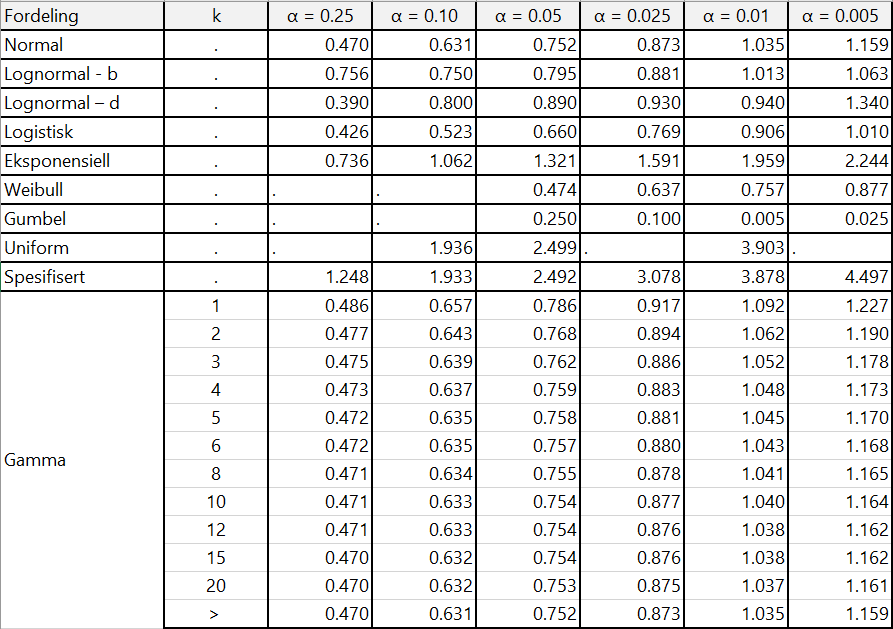

# Vedlegg 7 - Anderson-Darling test for normalitet{.unnumbered}

Jfr. @Anderson1954, @Stephens1979, @Jantschi2018 og @Zaiontz2020

```{r echo=FALSE, eval=TRUE}
pacman::p_load(knitr, tidyverse, kableExtra, flextable, magrittr)
```


```{r echo=FALSE, eval=TRUE}

text_tbl6 <- data.frame(
    'Fordeling' = c("Generisk/uniform", "Normal/lognormal", "Gamma $k=1$", "Gamma $k\\ge1$", "Eksponensiell", "Weilbull/Gumbel", "Logistisk"),
    'AD-verdi'= c("$$A=-n-\\frac{1}{n}\\sum_{i=1}^{n}(2_i-1)[lnF(X_i)+ln(1-F(X_{n-i+1}))]$$", "$$A^2=A(1+\\frac{75}{n}+\\frac{2.25}{n^2})$$","$$A(1+\\frac{6}{n})$$", "$$A+(\\frac{0.2+\\frac{0.3}{k}}{n})$$", "$$A(1+\\frac{6}{\\sqrt{n}})$$", "$$A(1+\\frac{0.2}{\\sqrt{n}})$$", "$$A(1+\\frac{0.25}{\\sqrt{n}})$$")
)

kable(text_tbl6, 
  align = "lc",
  escape = F, 
  caption = NULL) %>%
  kable_styling(latex_options = "hold_position", full_width = F) %>%
  row_spec(0, bold = T) %>%
  column_spec(1, width = '5cm') %>%
  column_spec(2, width = '10cm')

```
For gammafordeling  er *k* parameteret ("shape parameter") definert som $\alpha$.

Kritiske verdier for Anderson-Darling test. Merk: hvis man søker på nett finner man ulike framstillinger med noen avvikende verdier – vi har basert verdiene for normalfordeling på @DAgostino1986 [123, tabell 4.7]. Øvrige verdier er basert på @Marsaglia2004 og Stephens [-@Stephens1974;-@Stephens1976;-@Stephens1977;-@Stephens1978;-@Stephens1979a].  

Du kan laste ned tabellen i en Excel-fil her:
```{r echo=FALSE, eval=TRUE}
xfun::embed_file('AD-alpha.xlsx')
```


