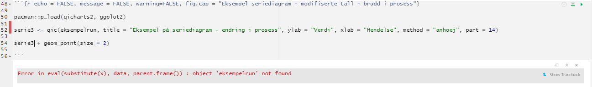

# Vedlegg 8 - Nedlasting, installasjon og enkel bruk av R og RStudio {.unnumbered}

Heniskten med dette vedlegget er å vise nedlasting og installasjon av R og RStudio, samt den helt grunnleggende bruken av R i RStudio. Målet er at dere skal kunne nok om R og RStudio til å kunne hente koder i vedlegg 1 og kjøre dette selv når dere jobber dere gjennom boka. Dere skal altså kunne replikere eksemplene i boka gjennom kode i vedlegg 1 ved å kjøre disse i RStudio på egen maskin.

Det finnes en god del gode ressurser for introduksjon til R, både på nett og i bokform. Ofte trekkes [R for Data Science](https://r4ds.had.co.nz/) av Garret Grolemund og Hadley Wickham fram som et veldig godt sted å lære R. Vi har hatt stor nytte av denne boka selv, ikke minst fordi den pivoterer rundt Hadleys tilnærming til R og data gjennom pakken *tidyverse*.

En annen god introduksjon til R er [An Introdcution to R](https://cran.r-project.org/doc/manuals/R-intro.pdf) av Venables, Smith og R Core Team.

De to siste ressursene vi vil nevne her er Derek Sondereggers [A Sufficient Introduction to R](https://dereksonderegger.github.io/570L/index.html) og [YaRrr! The Pirate's Guide to R](https://bookdown.org/ndphillips/YaRrr/). Det finnes som sagt mange andre nettressurser, ikke minst mange gode "how-to" videoer på YouTube og Vimeo. Dette fører oss til avslutningen på denne korte innledningen og et kjernebudskap når det gjelder R:

- Du finner **alltid** svar på noe du lurer på eller ikke får til i R på nett... (delekulturen er enorm)

## Nedlasting og installasjon av R {.unnumbered}

Vi har laget en kort video som viser nedlasting og installasjon av R og RStudio som ligger [her](https://vimeo.com/646555925)

Første steg er å laste ned selve R. Det gjør du ved å gå til [denne nettsiden](https://cran.uib.no/) og velge lenke ut fra ditt operativsystem (Windows, MacOS eller Linux):

I det følgende har jeg valgt Windows. Velg deretter "install R for the first time" (antar at du ikke allerede har R på din maskin...):

Og deretter:

Deretter er det i grunnen bare å følge "vanlige" prosedyrer (= følg instruksjonene) for å installere R på din maskin. Når du har installert kan det være lurt å se at det kjører. PÅ en PC (Win 10) kan du trykke på Windowssymbolet nederst til venstre på skjermen og deretter scrolle nedover i listen over apper (hos meg ser det slik ut):

Når du åpner R får du opp et tilsvarende skjermbilde som dette:

Jeg kjører altså versjon 4.0.5. R oppdateres jevnlig, og i skrivende stund er nyeste versjon 4.1.2. Det er ingen krise om man ikke kjører helt nyeste versjon av R, man skal være obs på at ved oppgradering av R-versjon kan man risikere å miste pakker (ingen krise - kan reinstalleres i de fleste tilfeller så lenge pakkene støtter den nye versjonen av R). For de som er interesserte i dette kan [How to Keep Your R Packages Up to Date](https://rfortherestofus.com/2020/09/how-to-update-rstudio-r-packages/) gi nyttig informasjon.

Når du nå har fått installert R er sjansene store for at du aldri åpner R igjen - jeg har siden installasjon i hvert fall aldri hatt behov for å kjøre R i sin egen form fordi jeg heldigvis har RStudio som legger seg utenpå R som et grafisk brukergrensesnitt (og gjør R-arbeid og livet langt enklere). 

## Nedlasting og installasjon av RStudio {.unnumbered}

RStudio er mye mer enn "bare" et grafisk brukergrensesnitt (vel, egentlig en "IDE" - "Integrated development environment"), men for oss i denne konteksten er RStudio programmet vi jobber med R i. I tillegg til å være utrolig nyttig er gratisversjonen alt vi trenger.

Nedlasting skjer [her](https://www.rstudio.com/products/rstudio/download/)

På denne siden velger du "RStudio Desktop":

Også her finnes det versjoner for ulike operativsystemer (Windows, macOS og ulike Linuxdistribusjoner):

Deretter er det som for R bare å følge installasjonsveiledningen undervegs.

## RStudio {.unnumbered}

Når du åpner RStudio første gang vil du trolig se dette:

Som for R vil du etter å ha tatt programmet i bruk sjeldent se akkurat dette oppsettet siden RStudio normalt vil åpne med siste økt i minnet (så lenge "ting" er lagret). Uansett - i vår kontekst ønsker vi å åpne en RMarkdown fil som vil vil bruke til å skrive inn/kopiere inn tekst og kode (hele denne boka er skrevet i RMarkdown i RStudio). 

Vi går da opp i menyen og velger å lage et nytt RMarkdown dokument:

Du får da opp et nytt vindu:

Her kan du bare la alt stå som foreslått, med mindre du ønsker å lage din egen tittel. RMarkdowndokumentet opprettes og ser slik ut (jeg har uthevet en del med blått - dette vil ikke være der hos dere):

 
Det som er uthevet i blått er informerende tekst RStudio lager som en slags introduksjon til RMarkdown. Du kan kjøre de to eksemplene som gis og se resultatet. Etter første gang vil du trolig bare ønske å merke alt slik jeg har gjort og slette alt. Merk: Du må ikke slette det som står øverst mellom de tre horisontale strekene (title:, author:, date: og output:). Når du har blitt mer dreven i RMarkdown kan du fiffe med dette også, men inntil videre er det en fordel å bare la det være. 

### Grunnleggende bruk av RStudio {.unnumbered}

RStudio er organisert i fire vinduer for å forenkle arbeidet.

I tekst og kodevinduet skrives - ikke overraskende - tekst og kode. Vanlig tekst skrives rett inn som i andre teksteditorer, men formatteringen er annerledes enn i f.eks. Word, men siden formålet her er å kunne kjøre kodeeksempler går vi ikke nærmere inn på dette her. 
Kode skrives inn i egne kodebolker. Det enkleste for å se framgangsmåten er å ta en titt på denne **videolink her** videoen som viser framgangsmåten steg for steg. 

I vedlegg 1 har vi gjengitt kode for ulike analyser, plott osv. En kodeblokk i RMarkdown ser slik ut:

For å kjøre denne kodeblokken (alle kodelinjene i blokken) kan vi trykke på Den grønne trekantpila i øverste høyre hjørne av kodeblokken. Hvis vi kun vil kjøre enkelte linjer av kodeblokken kan vi markere den/de linjene vi vil kjøre og trykke på samme trekantpil. 

Noen ganger vil vi oppleve at vi får en feilmelding - R vil ikke kjøre hele koden fordi det er noe feil i den. Det kan se slik ut:

RStudio vil markere med en rød strek til venstre for kodelinjene hvor den ikke forstår koden. I tillegg vil RStudio gi informajson om hva den ikke skjønner. Her kan vi umiddelbart legge til at det ikke er alltid det er så lett å forstå disse feilmeldingene. I eksempelet over vil vi imidlertid se at R ikke finner objektet "eksempelrun" som vi ber R gjøre noe med. Dette skyldes at vi lager dette objektet (datasettet) i kodeblokken over (i det virkelige tilfellet) og når vi ikke har kjørt denne tidligere kodeblokka er objektet ikke laget i vårt eksempel her. R kan naturligvis ikke behandle et objekt som ikke finnes. R er befriende logisk sånn sett...
Når vi først kjører den tidligere kodeblokka og deretter gjentar koden på bildet over får vi:

Vi håper selvsagt dere ikke vil oppleve problemer med å kjøre eksempelkodene brukt i denne boka og som er gitt i vedlegg 1. Det kan likevel hende selvsagt, og i så fall ber vi om tilbakemelding på dette - men som sagt er hensikten i denne konteksten kun å kjøre eksemplene, alle andre spørsmål om R/RStudio/RMarkdown må vi nesten henvise til andre hjelpemidler (som tidligere nevnt er Google et godt sted å begynne siden det finnes et svar på de fleste R/RStudio/RMarkdown relaterte spørsmål ute på den store vebben). 

